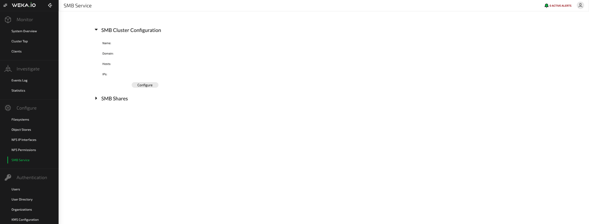
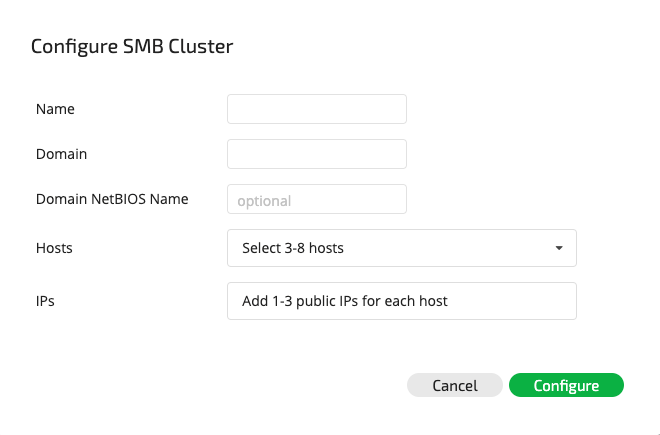
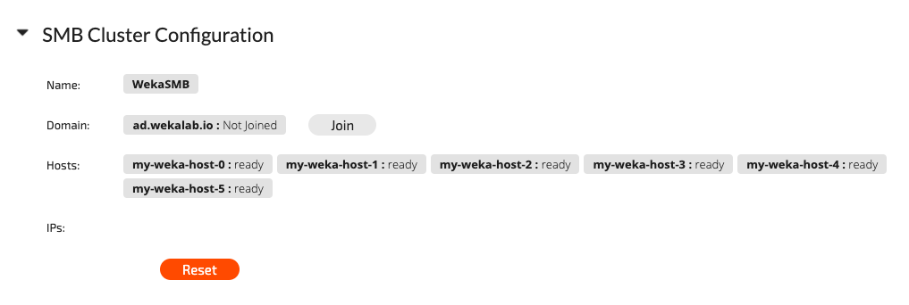
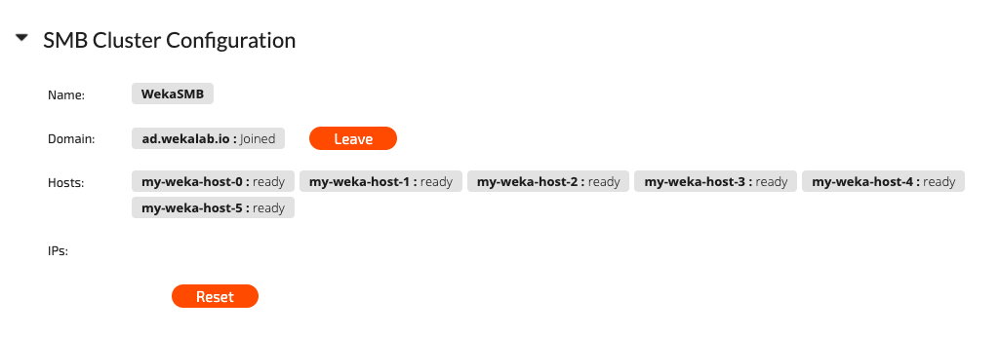
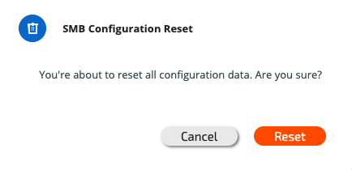
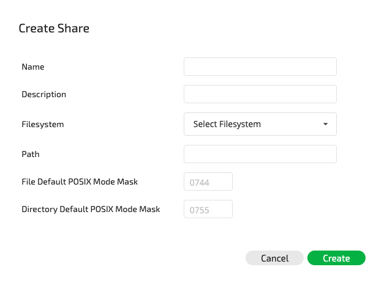
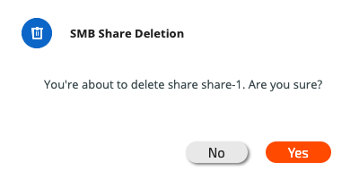

# SMB Management Using the GUI


**Note:** Use ASCII format when configuring name fields \(e.g., domain, shares, etc.\)


## **Configuring an SMB Cluster**

To configure an SMB cluster, first access the SMB Service view.

To configure the SMB cluster, click the Configure button. The following Configure Cluster window will be displayed:

Enter the name and domain, choose between 3 to 8 hosts and enter the IPs \(make sure to provide IPs equal to or 3 times greater than the number of hosts selected\). Then click the Configure button.


**Note:** in order to add an IP range, it is possible to use`a.b.c.x-y` notation.



**Note:** In AWS installations, it is not possible to enter a list of SMB service addresses. The SMB service must be accessed using the primary addresses of the cluster nodes.


The following SMB Cluster Configuration window will be displayed:


**Note:** The status of the hosts will change from not ready to ready.


## Joining the SMB Cluster to an Active Directory

To join the SMB cluster to an Active Directory, click the Join button when all hosts have been prepared and are ready. The following window will be displayed:

Enter the provided username and password in order to access the Active Directory. The Server input field is optional. The default for the Computers Org.Unit field is the Computers directory, but it is possible to define any other directory in Active Directory to be connected, such as SMB servers or Corporate computer.


**Note:** WEKA does not save the user password. A computer account is created on behalf of the user for the SMB cluster.



**Note:** The AD server must be the DNS server for the WEKA storage nodes in order for them to join the AD domain


On successful completion, the join status next to the domain will change to "joined" as shown below:

In order to join another Active Directory to the current SMB cluster configuration, click the Leave button. To confirm this action, it is necessary to enter the username and password used to connect to the Active Directory.


**Note:** To configure a new SMB cluster, the current Samba cluster has to be deleted.


## Deleting an SMB Cluster

To delete a configured SMB cluster, click the Reset button in the Configure SMB Cluster window. The following window will be displayed:

Confirm the deletion by clicking the Reset button.

## **Listing SMB Shares**

To access SMB shares**,** click the SMB Shares tab in the SMB Service Overview screen. A list of all SMB shares will be displayed**:**


**Note:** It is possible to filter this list using any column in the table.


## Adding an SMB Share

To add a new SMB share, click Create Share at the top right-hand corner of the table. The following Create Share window will be displayed:

Enter the new share name and description, select a filesystem and enter the path \(valid and relative internal path within the filesystem which will be exposed\). Also determine the new default file/directory permissions created through the share. Then click the Create button. The new share will receive the `readcache` mount mode.

## Removing an SMB Share

To remove an SMB share, click anywhere on the row to be removed and then click the Delete button.

The SMB Share Deletion window will be displayed**:**

Click the Yes button to confirm deletion of the share. The deleted share will no longer appear in the SMB Shares list.

