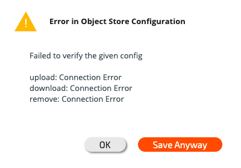
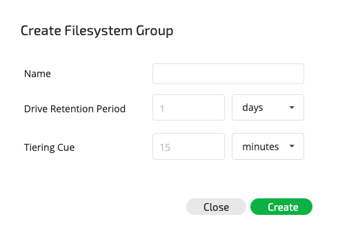
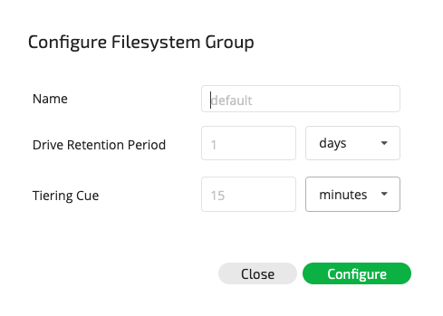
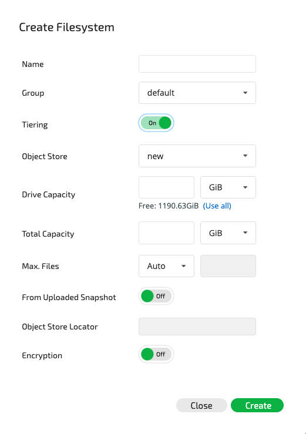
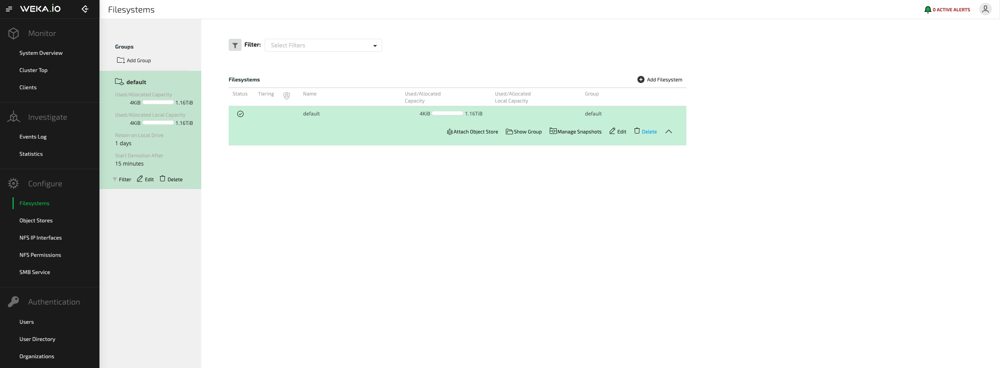
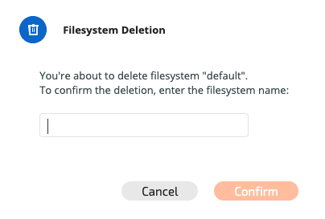
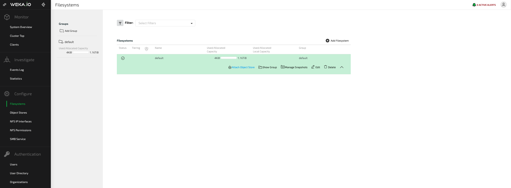
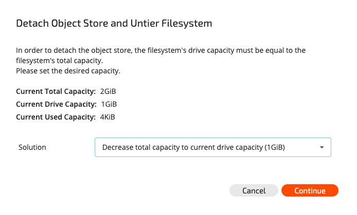

# Managing Filesystems, Object Stores & Filesystem Groups

## Viewing Filesystems and Filesystem Groups

#### Viewing Filesystems / Filesystem Groups Using the GUI

The main filesystem screen in the GUI contains information about the filesystems and filesystem groups, including names, tiering status, encryption status, total capacity and used capacity.

#### Viewing Filesystems / Filesystem Groups Using the CLI

**Command:** `weka fs` or `weka fs group`

These commands are used to view the filesystems \(`weka fs`\) or filesystem groups \(`weka fs group`\). To perform this operation, use the following command lines:

`weka fs`or `weka fs group`

## Managing Object Stores

### Viewing Object Stores

#### Viewing Object Stores Using the GUI

The main object store screen in the GUI lists all existing object stores and can also display information  about a specific object store, including the object store name, status and region.

####  Viewing Object Stores Using the CLI

**Command:** `weka fs tier s3`

This command is used to view information on all the object stores configured to the WekaIO system. 

### Adding an Object Store

#### Adding an Object Store Using the GUI

From the main object store view screen, click the "+" button at the top left-hand side of the screen. The Configure Object Store dialog box will be displayed.

Enter the relevant parameters and click Configure to create the object store.

If the object store is misconfigured, the Error in Object Store Configuration window will be displayed.

 Click Save Anyway in order to save the configured object store.

####  Adding an Object Store Using the CLI

**Command:** `weka fs tier s3 add`

Use the following command line to add an object store:

`weka fs tier s3 add <name> [--hostname=<host>] [--port=<port> [--bucket=<bucket>] [--auth-method=<auth-method>] [--region=<region>] [--access-key-id=<access-key-id>] [--secret-key=<secret-key>] [--protocol=<protocol>] [--bandwidth=<bandwidth>] [--errors-timeout=<errors-timeout>] [--prefetch-mib=<prefetch-mib>] [--max-concurrent-downloads=<max-concurrent-downloads>] [--max-concurrent-uploads=<max-concurrent-uploads>] [--max-concurrent-removals=<max-concurrent-removals>]`

**Parameters in Command Line**

| **Name** | **Type** | **Value** | **Limitations** | **Mandatory** | **Default** |
| :--- | :--- | :--- | :--- | :--- | :--- |
| `name` | String | Name of the object store being created | Must be a valid name | Yes | ​ |
| `hostname` | String | Object store host identifier | Must be a valid name/IP | Yes |  |
| `port` | String | Object store port | Must be a valid name | No | 80 |
| `bucket` | String | Object store bucket name | Must be a valid name | Yes |  |
| `auth-method` | String | Authentication method | None, AWSSignature2 or AWSSignature4 | Yes |  |
| `region` | String | Region name |  | Yes |  |
| `access-key-id` | String | Object store access key ID |  | Yes \(can be left empty when using IAM role in AWS\) |  |
| `secret-key` | String | Object store secret key |  | Yes \(can be left empty when using IAM role in AWS\) |  |
| `bandwidth` | Number | Bandwidth limitation per core \(Mbps\) |  | No |  |
| `errors-timeout` | Number | If the OBS link is down for longer than this timeout period, all IOs that need data return with an error | 1-15 minutes, e.g: 5m or 300s | No | 300 |
| `prefetch-mib` | Number | How many MiB of data to prefetch when reading a whole MiB on object store |  | No | 0 |
| `max-concurrent-downloads` | Number | Maximum number of downloads concurrently performed on this object store in a single IO node | 1-64 | No | 64 |
| `max-concurrent-uploads` | Number | Maximum number of uploads concurrently performed on this object store in a single IO node | 1-64 | No | 64 |
| `max-concurrent-removals` | Number | Maximum number of removals concurrently performed on this object store in a single IO node | 1-64 | No | 64 |


**Note:** When using the CLI, by default a misconfigured object store will not be created. To create an object store even when it is misconfigured, use the `--skip-verification`option.



**Note:** Up to 64 different object stores buckets can be configured in the WekaIO system.


### Editing an Object Store

#### Editing an Object Store Using the GUI

From the main object store view screen, click the Edit button of the object store to be edited.

The Update Object Store dialog box \(which is similar to the Configure Object Store dialog box\) will be displayed with the current specifications for the object store.

Make the relevant changes and click Update to update the object store.

#### Editing an Object Store Using the CLI

**Command:** `weka fs tier s3 update`

Use the following command line to edit an object store:

`weka fs tier s3 update <name> [--new-name=<new-name>] [--hostname=<host>] [--port=<port> [--bucket=<bucket>] [--auth-method=<auth-method>] [--region=<region>] [--access-key-id=<access-key-id>] [--secret-key=<secret-key>] [--protocol=<protocol>] [--bandwidth=<bandwidth>] [--errors-timeout=<errors-timeout>] [--prefetch-mib=<prefetch-mib>] [--max-concurrent-downloads=<max-concurrent-downloads>] [--max-concurrent-uploads=<max-concurrent-uploads>] [--max-concurrent-removals=<max-concurrent-removals>]`

**Parameters in Command Line**

| **Name** | **Type** | **Value** | **Limitations** | **Mandatory** | **Default** |
| :--- | :--- | :--- | :--- | :--- | :--- |
| `name` | String | Name of the object store being edited | Must be a valid name | Yes | ​ |
| `new-name` | String  | New name for the object store | Must be a valid name | No |  |
| `hostname` | String | Object store host identifier | Must be a valid name/IP | Yes |  |
| `port` | String | Object store port | Must be a valid name | Yes |  |
| `bucket` | String | Object store bucket name | Must be a valid name | Yes |  |
| `auth-method` | String | Authentication method | None, AWSSignature2 or AWSSignature4 | Yes |  |
| `region` | String | Region name |  | Yes |  |
| `access-key-id` | String | Object store access key ID |  | Yes \(can be left empty when using IAM role in AWS\) |  |
| `secret-key` | String | Object store secret key |  | Yes \(can be left empty when using IAM role in AWS\) |  |
| `bandwidth` | Number | Bandwidth limitation per core \(Mbps\) |  | No |  |
| `errors-timeout` | Number | If the OBS link is down for longer than this timeout period, all IOs that need data return with an error | 1-15 minutes, e.g: 5m or 300s | No | 300 |
| `prefetch-mib` | Number | How many MiB of data to prefetch when reading a whole MiB on object store |  | No | 0 |
| `max-concurrent-downloads` | Number | Maximum number of downloads concurrently performed on this object store in a single IO node | 1-64 | No | 64 |
| `max-concurrent-uploads` | Number | Maximum number of uploads concurrently performed on this object store in a single IO node | 1-64 | No | 64 |
| `max-concurrent-removals` | Number | Maximum number of removals concurrently performed on this object store in a single IO node | 1-64 | No | 64 |

### Deleting an Object Store

#### Deleting an Object Store Using the GUI

From the main object store view screen, click the Delete button of the object store to be deleted.

The Deletion of Object Store window will be displayed.  

Click Yes to delete the object store.

#### Deleting an Object Store Using the CLI

**Command:** `weka fs tier s3 delete`

Use the following command line to delete an object store:

 `weka fs tier s3 delete <name>`

**Parameters in Command Line**

| **Name** | **Type** | **Value** | **Limitations** | **Mandatory** | **Default** |
| :--- | :--- | :--- | :--- | :--- | :--- |
| `name` | String | Name of the object store being deleted | Must be a valid name | Yes | ​ |

## Managing Filesystem Groups

### Adding a Filesystem Group

#### Adding a Filesystem Group Using the GUI

From the main filesystem / filesystem group view screen, click the Add Group button at the top left-hand side of the screen. The Add Filesystem group screen will be displayed.

The Create Filesystem Group dialog box will be displayed.

Enter the relevant parameters and click Create to create the filesystem group.

#### Adding a Filesystem Group Using the CLI

**Command:** `weka fs group create`

Use the following command to add a filesystem group:

`weka fs group create <name> [--target-ssd-retention=<retention>] [--start-demote=<demote>]`

**Parameters in Command Line**

| **Name** | **Type** | **Value** | **Limitations** | **Mandatory** | **Default** |
| :--- | :--- | :--- | :--- | :--- | :--- |
| `name` | String | Name of the filesystem group being created | Must be a valid name | Yes | ​ |
| `target-ssd-retention` | Number | Target retention period \(in seconds\) before tiering to the object store | Must be a valid number | No | 86400 \(24 hours\) |
| `start-demote` | Number | Target tiering cue \(in seconds\) before tiering to the object store | Must be a valid number | No | 10 |

### Editing a Filesystem Group

#### Editing an Existing Filesystem Group Using the GUI

Click the Edit button of the filesystem group to be modified. The Configure Filesystem Group dialog box will be displayed.

For a more in-depth explanation of the tiering policy, refer to [Advanced Data Lifecycle Management](tiering.md).

Edit the existing filesystem group parameters and click Configure to execute the changes.

#### Editing an Existing Filesystem Group Using the CLI

**Command:** `weka fs group update`

Use the following command to edit a filesystem group:

`weka fs group update <name> [--new-name=<new-name>] [--target-ssd-retention=<retention>] [--start-demote=<demote>]`

**Parameters in Command Line**

| **Name** | **Type** | **Value** | **Limitations** | **Mandatory** | **Default** |
| :--- | :--- | :--- | :--- | :--- | :--- |
| `name` | String | Name of the filesystem group being edited | Must be a valid name | Yes | ​ |
| `new-name` | String | New name for the filesystem group | Must be a valid name | Yes |  |
| `target-ssd-retention` | Number | New target retention period \(in seconds\) before tiering to the object store | Must be a valid number | No |  |
| `start-demote` | Number | New target tiering cue \(in seconds\) before tiering to the object store | Must be a valid number | No |  |

### Deleting a Filesystem Group

#### Deleting a Filesystem Group Using the GUI


**Note:** Before deleting a filesystem group, verify that it does not contain any filesystems. If it contains filesystems, first delete the filesystems.


Select the filesystem group to be deleted in the main filesystem / filesystem group view screen and click the Delete button below the group. The Filesystem Group Deletion dialog box is displayed.

Click Yes to delete the filesystem group.

#### Deleting a Filesystem Group Using the CLI

A more in-depth explanation of the tiring policy appears in [Advanced Data Lifecycle Management](tiering.md).

**Command:** `weka fs group delete`

Use the following command line to delete a filesystem group:

`weka fs group delete <name>`

**Parameters in Command Line**

| **Name** | **Type** | **Value** | **Limitations** | **Mandatory** | **Default** |
| :--- | :--- | :--- | :--- | :--- | :--- |
| `name` | String | Name of the filesystem group to be deleted | Must be a valid name | Yes | ​ |

## Managing Filesystems

### Adding a Filesystem

#### Adding a Filesystem Using the GUI

From the main filesystem / filesystem group view screen, click the Add Filesystem button at the top right-hand side of the screen. The Add Filesystem screen will be displayed.

The Create Filesystem dialog box will be displayed.

Enter the relevant parameters and click Create to create the filesystem.

#### Adding a Filesystem Using the CLI

**Command:** `weka fs create`

Use the following command line to add a filesystem:

`weka fs create <name> <group-name> <total-capacity> [--ssd-capacity <ssd>] [--max-files <max-files>] [--filesystem-id <id>] [--encrypted] [--obs-name <obs-name>]`

**Parameters in Command Line**

| **Name** | **Type** | **Value** | **Limitations** | **Mandatory** | **Default** |
| :--- | :--- | :--- | :--- | :--- | :--- |
| `name` | String | Name of the filesystem being created | Must be a valid name | Yes | ​ |
| `group-name` | String | Name of the filesystem group to which the new filesystem is to be connected | Must be a valid name | Yes |  |
| `total-capacity` | Number | Total capacity of the new filesystem; options are SSD capacity \(`ssd-capacity <ssd>`\), the filesystem ID \(`filesystem-id <id>`\) or a value that correlates with the percentage of SSD capacity from the total SSD capacity for the cluster \(`max-files <max-files>`\) | Must be a valid number | Yes |  |
| `ssd-capacity` | Number | For tiered filesystems, this is the SSD capacity. If not specified, the filesystem is pinned to SSD | Must be a valid number | No | SSD capacity will be set to total capacity |
| `max-files` | Number | Metadata allocation for this filesystem | Must be a valid number | No | Automatically calculated by the system based on the SSD capacity |
| `encrypted` | Boolean | Encryption of filesystem |  | No | No |
| `obs-name` | String | Object store name for tiering | Must be a valid name | No |  |

### Editing a Filesystem

#### Editing an Existing Filesystem Using the GUI

Select the filesystem to be modified in the main filesystem / filesystem group view screen and click the Edit button.

 The Configure Filesystem dialog box will be displayed.

Edit the existing filesystem parameters and click Configure to execute the changes.


**Note:** It is not possible to change the encryption configuration of a filesystem.


#### Editing an Existing Filesystem Using the CLI

**Command:** `weka fs update`

Use the following command line to edit an existing filesystem:

`weka fs update <name> [--new-name=<new-name>] [--total-capacity=<total>] [--ssd-capacity=<ssd>] [--max-files=<max-files>]`

**Parameters in Command Line**

| **Name** | **Type** | **Value** | **Limitations** | **Mandatory** | **Default** |
| :--- | :--- | :--- | :--- | :--- | :--- |
| `name` | String | Name of the filesystem being edited | Must be a valid name | Yes | ​ |
| `new-name` | String | New name for the filesystem | Must be a valid name | Optional | Keep unchanged |
| `total` | Number | Total capacity of the edited filesystem | Must be a valid number | Optional | Keep unchanged |
| `ssd` | Number | SSD capacity of the edited filesystem | Must be a valid number | Optional | Keep unchanged |
| `max-files` | Number | Metadata limit for the filesystem | Must be a valid number | Optional | Keep unchanged |

### Deleting a Filesystem

#### Deleting a Filesystem Using the GUI

Select the filesystem to be deleted in the main filesystem / filesystem group view screen and click the Delete button.

The Filesystem Deletion dialog box is displayed. 

Confirm the filesystem deletion by typing the name of the filesystem and clicking Confirm.

#### Deleting a Filesystem Using the CLI

**Command:** `weka fs delete`

Use the following command line to delete a filesystem:

`weka fs delete <name>`

**Parameters in Command Line**

| **Name** | **Type** | **Value** | **Limitations** | **Mandatory** | **Default** |
| :--- | :--- | :--- | :--- | :--- | :--- |
| `name` | String | Name of the filesystem to be deleted | Must be a valid name | Yes |  |

## Attaching/Detaching Object Stores to Filesystems

### Attaching an Object Store to a Filesystem

Two object stores can be attached to a filesystem, but only one of the object stores will be writable. When attaching a new object store to an already tiered filesystem, the existing object store bucket becomes read-only, and the new object store bucket is read/write. Multiple object stores allow a range of use cases, including migration to different object stores, scaling of object store capacity and increasing the total tiering capacity of filesystems.

When attaching an object store to a non-tiered filesystem, the filesystem becomes tiered. 

### Detaching an Object Store from a Filesystem

Detaching an object store from a filesystem migrates the filesystem data residing in the object store bucket either to the writable object-store \(if one exists\) or to the SSD, as described below. When detaching, the background task of detaching the object store begins. Detaching can be a long process, depending on the amount of data and the load on the object stores. For more information, refer to [Background Tasks](../usage/background-tasks.md).

#### Migrating to a Different Object Store

When detaching from a filesystem tiered to two object stores, only the read-only object store can be detached. In such cases, the background task will copy the relevant data to the writable object store. 

#### Un-tiering a Filesystem

Detaching from a filesystem tiered to one object store will un-tier the filesystem and copy the data back to the SSD.


**Note:** The SSD must have sufficient capacity, i.e., the allocated SSD capacity should be at least the total capacity used by the filesystem.


On completion of detaching, the object store does not appear under the filesystem when using the `weka fs` ****command. However, it still appears under the object store and can be removed if it is not being used by any other filesystem. The data in the read-only object store remains in the object store bucket for backup purposes. If this is unnecessary or the reclamation of object store space is required, it is possible to delete the object store bucket. 


**Note:** Before deleting an object store bucket, remember to take into account data from another filesystem or data not relevant to the WekaIO system on the object store bucket.



**Note:** When there are two object stores attached and during the execution of migration, it is not possible to upload new snapshots to the object store.


#### Attaching/Detaching Object Stores Using the GUI

To attach a new object store to a filesystem, select the filesystem in the main filesystem/filesystem group view screen and click the Attach Object Store button.

The Attach Object Store to Filesystem dialog box will be displayed.

Select the object store to attach and click Attach. 

To detach an object store from a filesystem, select the filesystem in the main filesystem/filesystem group view screen. A list of all attached object stores will be displayed in the Attached Object Stores dialog box. 

Click the Detach button next to the relevant object store to be detached. If more than one object store is attached, the Detach Object Store dialog box will be displayed as follows:

Click Yes to detach the object store from the filesystem.

If there is only one object store attached, detaching will un-tier the filesystem and the following Detach Object Store and Untier Filesystem dialog box will be displayed:

Since object stores usually expand the filesystem capacity, the un-tiering of a filesystem requires adjustment of its total capacity. It is possible to increase the SSD capacity to match the current total capacity; reduce the total filesystem capacity to match the SSD capacity or used capacity \(the decrease option depends on the used capacity\); or configure a different value.


**Note:** Used capacity should be taken into account. Since un-tiering takes time to propagate the data from the object store to the SSD, when un-tiering an active filesystem it is recommended to adjust to a higher value than the used capacity, in order to accommodate the additional writes during the detaching process.


The following options are available in the Solution drop-down list: 

Select the desired option and click Continue in the Detach Object Store and Untier Filesystem dialog box. A summary dialog box of the system operations will be displayed.

To confirm the operation, click Detach.  

#### Attaching/Detaching Object Stores Using the CLI

**Command:** `weka fs tier s3 attach`or `weka fs tier s3 detach`

To attach an object store to a filesystem, use the following command:

`weka fs tier s3 attach fs-name obs-name`

To detach an object store from a filesystem, use the following command:

`weka fs tier s3 detach fs-name obs-name`

**Parameters in Command Line**

| **Name** | **Type** | **Value** | **Limitations** | **Mandatory** | **Default** |
| :--- | :--- | :--- | :--- | :--- | :--- |
| `fs-name` | String | Name of the filesystem to be attached to / detached from the object store | Must be a valid name | Yes | ​ |
| `obs-name` | String | Name of the object store to be  attached / detached | Must be a valid name | Yes |   |

