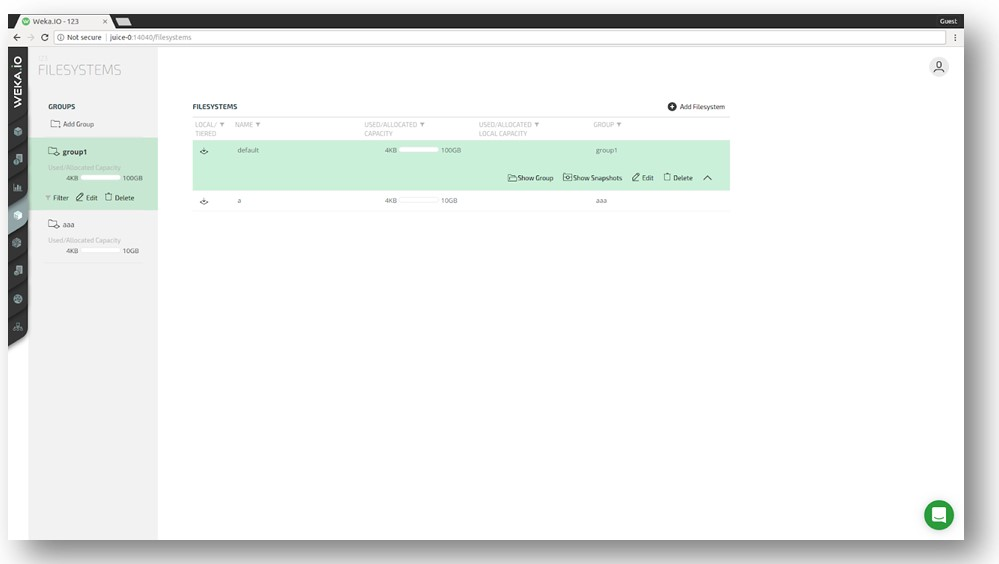
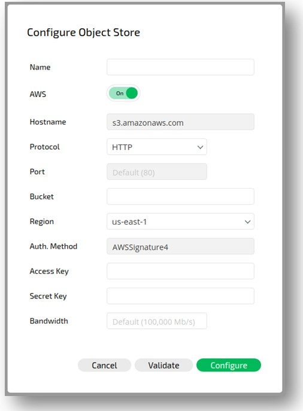
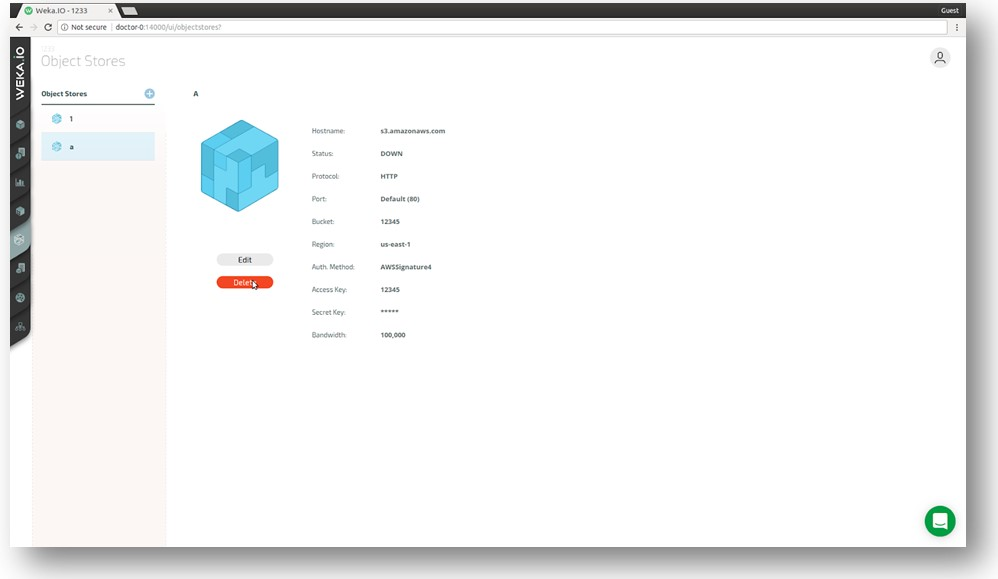
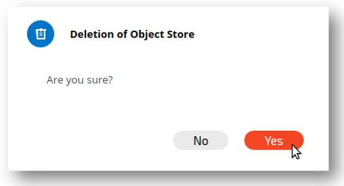
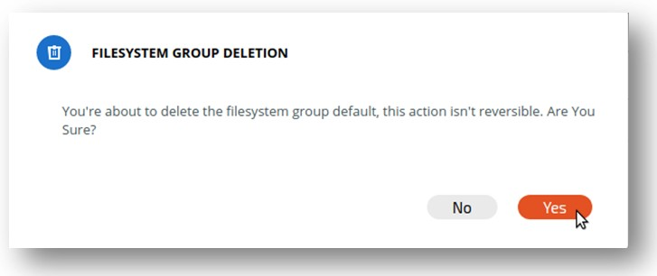
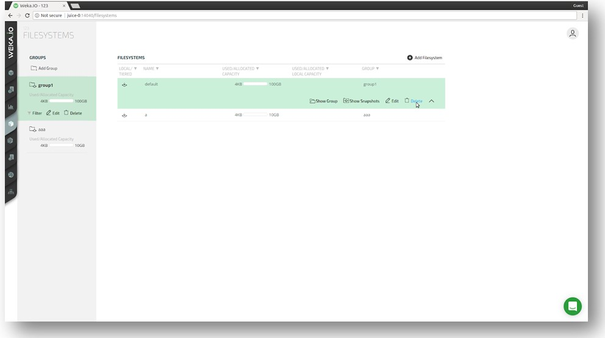
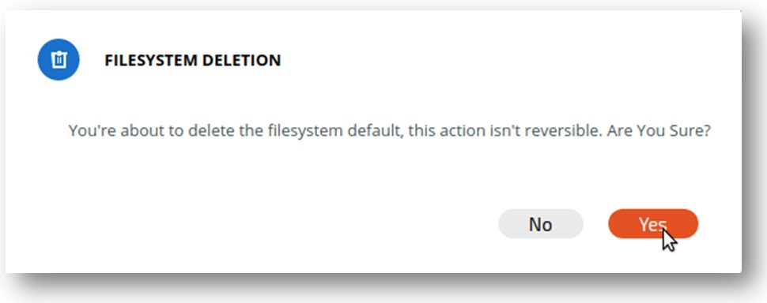

# Managing Filesystems, Object Stores & Filesystem Groups

## Viewing Filesystems and Filesystem Groups

#### Viewing Filesystems / Filesystem Groups Using the GUI

The main filesystem screen in the GUI contains information about the filesystems and filesystem groups, including names, tiering status, total capacity and used capacity.

#### Viewing Filesystems / Filesystem Groups Using the CLI

**Command:** `weka fs` or `weka fs group`

These commands are used to view the filesystems \(`weka fs`\) or filesystem groups \(`weka fs group`\). To perform this operation, use the following command lines:

`weka fs`or `weka fs group`

## Managing Object Stores

### Viewing Object Stores

#### Viewing Object Stores Using the GUI

The main object store screen in the GUI lists all existing object stores and can also display information  about a specific object store, including the object store name, status and region.

####  Viewing Object Stores Using the CLI

**Command:** `weka fs tier s3`

This command is used to view information on all the object stores configured to the Weka system. 

### Adding an Object Store

#### Adding an Object Store Using the GUI

From the main object store view screen, click the "+" button at the top left-hand side of the screen. The Configure Object Store dialog box will be displayed.

Enter the relevant parameters and click Configure to create the object store.

If the object store is misconfigured, the Error in Object Store Configuration window will be displayed.

 Click Save Anyway in order to save the configured object store.

####  Adding an Object Store Using the CLI

**Command:** `weka fs tier s3 add`

Use the following command line to add an object store:

`weka fs tier s3 add <name> [--hostname=<host>] [--port=<port>] [--bucket=<bucket>] [--auth-method=<auth>] [--region=<region>] [--access-key-id=<access>] [--secret-key=<secret>] [--dry-run] [--skip-verification] [--bandwidth=<bw>] [--verbose-errors] [--errors-timeout=<timeout>] [options]`

**Parameters in Command Line**

| **Name** | **Type** | **Value** | **Limitations** | **Mandatory** | **Default** |
| :--- | :--- | :--- | :--- | :--- | :--- |
| `name` | String | The name of the object store being created | Must be a valid name | Yes | ​ |
| `host` | String | The object store host name | Must be a valid name | Yes |  |
| `port` | String | The object store port | Must be a valid name | Yes |  |
| `bucket` | Number | The object store bucket ID | Must be a valid name | Yes |  |
| `auth` |  |  |  |  |  |
| `region` |  |  |  |  |  |
| `access` | Number | The object store access key ID | Must be a valid number | Yes |  |
| `secret` |  |  |  |  |  |
| `bw` | Number | The bandwidth |  |  |  |
| `timeout` |  |  |  |  |  |


**Note:** By default, when using the CLI, a misconfigured object store will not be created. To create the object store even when it is misconfigured, use the option `--skip-verification`.


### Editing an Object Store

#### Editing an Object Store Using the GUI

From the main object store view screen, click the Edit button of the object store to be edited.

The Update Object Store dialog box \(which is similar to the Configure Object Store dialog box\) will be displayed with the current specifications for the object store.

Make the relevant changes and click Update to update the object store.

#### Editing an Object Store Using the CLI

**Command:** `weka fs tier s3 update`

Use the following command line to edit an object store:

`weka fs tier s3 update <name> [--hostname=<host>] [--port=<port>] [--bucket=<bucket>] [--auth-method=<auth>] [--region=<region>] [--access-key-id=<access>] [--secret-key=<secret>] [--dry-run] [--skip-verification] [--bandwidth=<bw>] [--verbose-errors] [--errors-timeout=<timeout>] [options]`

**Parameters in Command Line**

| **Name** | **Type** | **Value** | **Limitations** | **Mandatory** | **Default** |
| :--- | :--- | :--- | :--- | :--- | :--- |
| `name` | String | The name of the object store being edited | Must be a valid name | Yes | ​ |
| `host` | String | The object store host name | Must be a valid name | Yes |  |
| `port` | String | The object store port | Must be a valid name | Yes |  |
| `bucket` | Number | The object store bucket ID | Must be a valid name | Yes |  |
| `auth` |  |  |  |  |  |
| `region` |  |  |  |  |  |
| `access` | Number | The object store access key ID | Must be a valid number | Yes |  |
| `secret` |  |  |  |  |  |
| `bw` | Number | The bandwidth |  |  |  |
| `timeout` |  |  |  |  |  |

### Deleting an Object Store

#### Deleting an Object Store Using the GUI

From the main object store view screen, click the Delete button of the object store to be deleted.

The Deletion of Object Store window will be displayed.  

Click Yes to delete the object store.

#### Deleting an Object Store Using the CLI

**Command:** `weka fs tier s3 delete`

Use the following command line to delete an object store:

 `weka fs tier s3 delete <name>`

**Parameters in Command Line**

| **Name** | **Type** | **Value** | **Limitations** | **Mandatory** | **Default** |
| :--- | :--- | :--- | :--- | :--- | :--- |
| `name` | String | The name of the object store being deleted | Must be a valid name | Yes | ​ |

## Managing Filesystem Groups


**Note:**  The following sections describe how to add, edit and delete filesystem groups using the GUI and CLI.


### Adding a Filesystem Group

#### Adding a Filesystem Group Using the GUI

From the main filesystem / filesystem group view screen, click the Add Group button at the top left-hand side of the screen. The Add Filesystem group screen will be displayed.

The Create Filesystem Group dialog box will be displayed.

Enter the relevant parameters and click Create to create the filesystem group.


**Note:** The tiering status is selected in the GUI using the switch. However, in the CLI, this requires the use of different commands.


#### Adding a Filesystem Group Using the CLI

**Command:** `weka fs group create`


**Note:** In the CLI, defining the tiering status for a new filesystem group requires the use of a different command.


Use one of the following command lines to add a filesystem group:

For a non-tiered filesystem group:

`weka fs group create <name>`

 For a tiered filesystem group:

`weka fs group create <name> --is-tiered=yes --storage=<object-store-name> [--target-ssd-retention=<retention>] [--start-demote=<demote>]`

**Parameters in Command Line**

| **Name** | **Type** | **Value** | **Limitations** | **Mandatory** | **Default** |
| :--- | :--- | :--- | :--- | :--- | :--- |
| `name` | String | The name of the filesystem group being created | Must be a valid name | Yes | ​ |
| `storage` | String | The ID of the object store for storage | Must be a valid name | Yes |  |
| `target-ssd-retention` | Number | The target retention period \(in seconds\) before tiering to the object store | Must be a valid number | No | 86400 \(24 hours\) |
| `start-demote` | Number | The target tiering cue \(in seconds\) before tiering to the object store. | Must be a valid number | No | 10 |

### Editing a Filesystem Group

#### Editing an Existing Filesystem Group Using the GUI

Click the Edit button of the filesystem group to be modified. The Configure Filesystem Group dialog box will be displayed.

Edit the existing filesystem group parameters and click Configure to execute the changes.

#### Editing an Existing Filesystem Using the CLI

**Command:** `weka fs group update --is-tiered`

Use one of the following command lines to edit a filesystem group:

For a non-tiered filesystem group:

`weka fs group update <name> [--new-name=<new-name>]`

To add a tier to a filesystem group:

`weka fs group update <name> <storage> [--new-name=<new-name>] --is-tiered=yes --storage=<object-store-name> [--target-ssd-retention=<retention>] [--start-demote=<demote>]`

**Parameters in Command Line**

| **Name** | **Type** | **Value** | **Limitations** | **Mandatory** | **Default** |
| :--- | :--- | :--- | :--- | :--- | :--- |
| `name` | String | The name of the filesystem group being edited | Must be a valid name | Yes | ​ |
| `new-name` | String | The new name for the filesystem group | Must be a valid name | Yes |  |
| `storage` | String | The ID of the object store for storage | Must be a valid name | Yes |  |
| `target-ssd-retention` | Number | The new target retention period \(in seconds\) before tiering to the object store | Must be a valid number | No |  |
| `start-demote` | Number | The new target tiering cue \(in seconds\) before tiering to the object store | Must be a valid number | No |  |

### Deleting a Filesystem Group

#### Deleting a Filesystem Using the GUI


**Note:** Before deleting a filesystem group, verify that it does not contain any filesystems. If it contains filesystems, first delete the filesystems.


Select the filesystem group to be deleted in the main filesystem / filesystem group view screen and click the Delete button below the group. The filesystem group deletion dialog box is displayed.

Click Yes to delete the filesystem group.

#### Deleting a Filesystem Using the CLI

**Command:** `weka fs group delete`

Use the following command line to delete a filesystem group:

`weka fs group delete <name>`

**Parameters in Command Line**

| **Name** | **Type** | **Value** | **Limitations** | **Mandatory** | **Default** |
| :--- | :--- | :--- | :--- | :--- | :--- |
| `name` | String | The name of the filesystem group to be deleted | Must be a valid name | Yes | ​ |

## Managing Filesystems


**Note:**  The following sections describe how to add, edit and delete filesystems using the GUI and CLI.


### Adding a Filesystem

#### Adding a Filesystem Using the GUI

From the main filesystem / filesystem group view screen, click the Add Filesystem button at the top right-hand side of the screen. The Add Filesystem screen will be displayed.

The Create Filesystem dialog box will be displayed.

Enter the relevant parameters and click Create to create the filesystem.

#### Adding a Filesystem Using the CLI

**Command:** `weka fs create`

Use the following command line to add a filesystem:

`weka fs create <name> <group-name> <total-capacity> [--ssd-capacity <ssd>] [--max-files <max-files>] [--filesystem-id <id>]`

**Parameters in Command Line**

| **Name** | **Type** | **Value** | **Limitations** | **Mandatory** | **Default** |
| :--- | :--- | :--- | :--- | :--- | :--- |
| `name` | String | The name of the filesystem being created | Must be a valid name | Yes | ​ |
| `group-name` | String | The name of the filesystem group to which the new filesystem is to be connected | Must be a valid name | Yes |  |
| `total-capacity` | Number | The total capacity of the new filesystem; options are SSD capacity \(`ssd-capacity <ssd>`\), the filesystem ID \(`filesystem-id <id>`\) or a value that correlates with the percentage of SSD capacity from the total SSD capacity for the cluster \(`max-files <max-files>`\) | Must be a valid number | Yes |  |
| `ssd-capacity` | Number | For tiered filesystems, this is the SSD capacity. If not specified, the filesystem is pinned to SSD | Must be a valid number | No | SSD capacity will be set to total capacity |
| `max-files` | Number | Metadata allocation for this filesystem | Must be a valid number | No | Automatically calculated by the system based on the SSD capacity |

### Editing a Filesystem

#### Editing an Existing Filesystem Using the GUI

Select the filesystem to be modified in the main filesystem / filesystem group view screen and click the Edit button.

 The Configure Filesystem dialog box will be displayed.

Edit the existing filesystem parameters and click Configure to execute the changes.

#### Editing an Existing Filesystem Using the CLI

**Command:** `weka fs update`

Use the following command line to edit an existing filesystem:

`weka fs update <name> [--new-name=<new-name>] [--total-capacity=<total>] [--ssd-capacity=<ssd>] [--max-files=<max-files>]`

**Parameters in Command Line**

| **Name** | **Type** | **Value** | **Limitations** | **Mandatory** | **Default** |
| :--- | :--- | :--- | :--- | :--- | :--- |
| `name` | String | The name of the filesystem being edited | Must be a valid name | Yes | ​ |
| `new-name` | String | The new name for the filesystem | Must be a valid name | Optional | Keep unchanged |
| `total` | Number | The total capacity of the edited filesystem | Must be a valid number | Optional | Keep unchanged |
| `ssd` | Number | The SSD capacity of the edited filesystem | Must be a valid number | Optional | Keep unchanged |
| `max-files` | Number | The metadata limit for the filesystem | Must be a valid number | Optional | Keep unchanged |

### Deleting a Filesystem

#### Deleting a Filesystem Using the GUI

Select the filesystem to be deleted in the main filesystem / filesystem group view screen and click the Delete button.

Then confirm the filesystem deletion by click Yes in the Filesystem Deletion dialog box.

#### Deleting a Filesystem Using the CLI

**Command:** `weka fs delete`

Use the following command line to delete a filesystem:

`weka fs delete <name>`

**Parameters in Command Line**

| **Name** | **Type** | **Value** | **Limitations** | **Mandatory** | **Default** |
| :--- | :--- | :--- | :--- | :--- | :--- |
| `name` | String | The name of the filesystem to be deleted | Must be a valid name | Yes | ​ |

