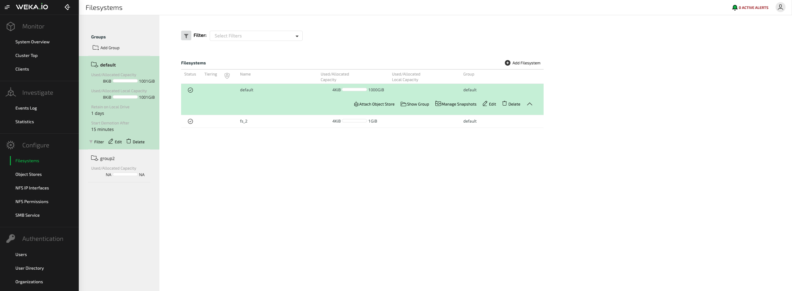
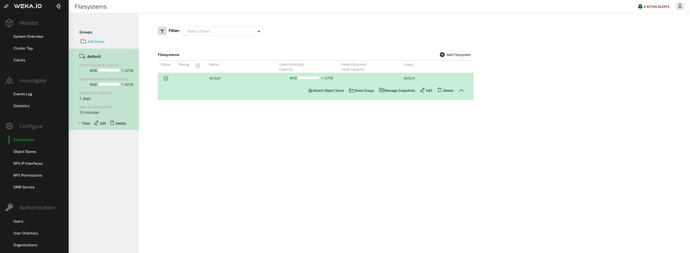

# Managing Filesystem Groups

## Viewing Filesystem Groups

### Viewing Filesystem Groups Using the GUI

The main Filesystems screen in the GUI contains information about the filesystem groups, including names and tiering policy.

### Viewing Filesystem Groups Using the CLI

**Command:** `weka fs group`

Use this commands to view information on the filesystem groups in the WekaIO system.

## Adding a Filesystem Group

### Adding a Filesystem Group Using the GUI

From the main filesystem / filesystem group view screen, click the Add Group button at the top left-hand side of the screen. The Add Filesystem group screen will be displayed.

The Create Filesystem Group dialog box will be displayed.

Enter the relevant parameters and click Create to create the filesystem group.

### Adding a Filesystem Group Using the CLI

**Command:** `weka fs group create`

Use the following command to add a filesystem group:

`weka fs group create <name> [--target-ssd-retention=<retention>] [--start-demote=<demote>]`

**Parameters in Command Line**

| **Name** | **Type** | **Value** | **Limitations** | **Mandatory** | **Default** |
| :--- | :--- | :--- | :--- | :--- | :--- |
| `name` | String | Name of the filesystem group being created | Must be a valid name | Yes | ​ |
| `target-ssd-retention` | Number | Target retention period \(in seconds\) before tiering to the object store | Must be a valid number | No | 86400 \(24 hours\) |
| `start-demote` | Number | Target tiering cue \(in seconds\) before tiering to the object store | Must be a valid number | No | 10 |

## Editing a Filesystem Group

### Editing an Existing Filesystem Group Using the GUI

Click the Edit button of the filesystem group to be modified. The Configure Filesystem Group dialog box will be displayed.

For a more in-depth explanation of the tiering policy, refer to [Advanced Data Lifecycle Management](../tiering/).

Edit the existing filesystem group parameters and click Configure to execute the changes.

### Editing an Existing Filesystem Group Using the CLI

**Command:** `weka fs group update`

Use the following command to edit a filesystem group:

`weka fs group update <name> [--new-name=<new-name>] [--target-ssd-retention=<retention>] [--start-demote=<demote>]`

**Parameters in Command Line**

| **Name** | **Type** | **Value** | **Limitations** | **Mandatory** | **Default** |
| :--- | :--- | :--- | :--- | :--- | :--- |
| `name` | String | Name of the filesystem group being edited | Must be a valid name | Yes | ​ |
| `new-name` | String | New name for the filesystem group | Must be a valid name | Yes |  |
| `target-ssd-retention` | Number | New target retention period \(in seconds\) before tiering to the object store | Must be a valid number | No |  |
| `start-demote` | Number | New target tiering cue \(in seconds\) before tiering to the object store | Must be a valid number | No |  |

## Deleting a Filesystem Group

### Deleting a Filesystem Group Using the GUI


**Note:** Before deleting a filesystem group, verify that it does not contain any filesystems. If it contains filesystems, first delete the filesystems.


Select the filesystem group to be deleted in the main filesystem / filesystem group view screen and click the Delete button below the group. The Filesystem Group Deletion dialog box is displayed.

Click Yes to delete the filesystem group.

### Deleting a Filesystem Group Using the CLI

A more in-depth explanation of the tiring policy appears in [Advanced Data Lifecycle Management](../tiering/).

**Command:** `weka fs group delete`

Use the following command line to delete a filesystem group:

`weka fs group delete <name>`

**Parameters in Command Line**

| **Name** | **Type** | **Value** | **Limitations** | **Mandatory** | **Default** |
| :--- | :--- | :--- | :--- | :--- | :--- |
| `name` | String | Name of the filesystem group to be deleted | Must be a valid name | Yes | ​ |

## 

