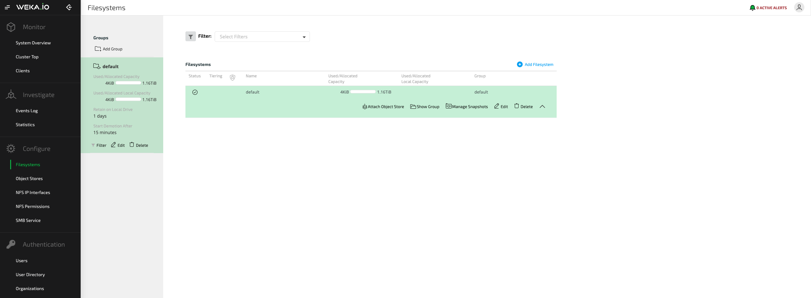
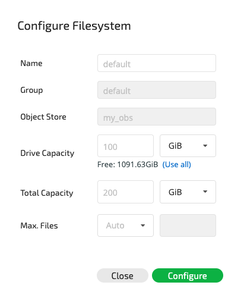

# Managing Filesystems

## Viewing Filesystems

### Viewing Filesystems Using the GUI

The main Filesystems screen in the GUI contains information about the filesystems, including names, tiering status, encryption status, total capacity and used capacity.

### Viewing Filesystems Using the CLI

**Command:** `weka fs`

Use this commands to view information on the filesystems in the Weka system.

## Adding a Filesystem

### Adding a Filesystem Using the GUI

From the main filesystem / filesystem group view screen, click the Add Filesystem button at the top right-hand side of the screen. The Add Filesystem screen will be displayed.

The Create Filesystem dialog box will be displayed.

Enter the relevant parameters and click Create to create the filesystem.

### Adding a Filesystem Using the CLI

**Command:** `weka fs create`

Use the following command line to add a filesystem:

`weka fs create <name> <group-name> <total-capacity> [--ssd-capacity <ssd>] [--max-files <max-files>] [--filesystem-id <id>] [--encrypted] [--obs-name <obs-name>] [--auth-required auth]`

**Parameters in Command Line**

| **Name** | **Type** | **Value** | **Limitations** | **Mandatory** | **Default** |
| :--- | :--- | :--- | :--- | :--- | :--- |
| `name` | String | Name of the filesystem being created | Must be a valid name | Yes | ​ |
| `group-name` | String | Name of the filesystem group to which the new filesystem is to be connected | Must be a valid name | Yes |  |
| `total-capacity` | Number | Total capacity of the new filesystem | Minimum of 1GiB | Yes |  |
| `ssd-capacity` | Number | For tiered filesystems, this is the SSD capacity. If not specified, the filesystem is pinned to SSD | Minimum of 1GiB | No | SSD capacity will be set to total capacity |
| `max-files` | Number | Metadata allocation for this filesystem | Must be a valid number | No | Automatically calculated by the system based on the SSD capacity |
| `encrypted` | Boolean | Encryption of filesystem |  | No | No |
| `obs-name` | String | Object store name for tiering | Must be a valid name | Mandatory for tiered filesystems |  |
| `auth-required` | String | Determined if mounting the filesystem requires to be authenticated to Weka \([weka user login](../../usage/user-management.md#user-log-in)\)  | `yes` or `no` | No | no |


**Note:** When creating an encrypted filesystem a KMS must be defined.



**Note:** To define an encrypted filesystem without a KMS, it is possible to use the`--allow-no-kms` parameter in the command. This can be useful when running POCs but should not be used in production, since the security chain is compromised when a KMS is not used.

If filesystem keys exist when adding a KMS, they are automatically re-encrypted by the KMS for any future use.


## Editing a Filesystem

### Editing an Existing Filesystem Using the GUI

Select the filesystem to be modified in the main filesystem / filesystem group view screen and click the Edit button.

The Configure Filesystem dialog box will be displayed.

Edit the existing filesystem parameters and click Configure to execute the changes.


**Note:** It is not possible to change the encryption configuration of a filesystem.


### Editing an Existing Filesystem Using the CLI

**Command:** `weka fs update`

Use the following command line to edit an existing filesystem:

`weka fs update <name> [--new-name=<new-name>] [--total-capacity=<total>] [--ssd-capacity=<ssd>] [--max-files=<max-files>]`

**Parameters in Command Line**

| **Name** | **Type** | **Value** | **Limitations** | **Mandatory** | **Default** |
| :--- | :--- | :--- | :--- | :--- | :--- |
| `name` | String | Name of the filesystem being edited | Must be a valid name | Yes | ​ |
| `new-name` | String | New name for the filesystem | Must be a valid name | Optional | Keep unchanged |
| `total` | Number | Total capacity of the edited filesystem | Must be a valid number | Optional | Keep unchanged |
| `ssd` | Number | SSD capacity of the edited filesystem | Must be a valid number | Optional | Keep unchanged |
| `max-files` | Number | Metadata limit for the filesystem | Must be a valid number | Optional | Keep unchanged |
| `auth-required` | String | Determined if mounting the filesystem requires to be authenticated to Weka \([weka user login](../../usage/user-management.md#user-log-in)\)  | `yes` or `no` | No | no |

## Deleting a Filesystem

### Deleting a Filesystem Using the GUI

Select the filesystem to be deleted in the main filesystem / filesystem group view screen and click the Delete button.

The Filesystem Deletion dialog box is displayed.

Confirm the filesystem deletion by typing the name of the filesystem and clicking Confirm.

### Deleting a Filesystem Using the CLI

**Command:** `weka fs delete`

Use the following command line to delete a filesystem:

`weka fs delete <name> [--purge-from-obs]`

**Parameters in Command Line**

| **Name** | **Type** | **Value** | **Limitations** | **Mandatory** | **Default** |
| :--- | :--- | :--- | :--- | :--- | :--- |
| `name` | String | Name of the filesystem to be deleted | Must be a valid name | Yes |  |
| `purge-from-obs` | Boolean | For a tiered filesystem, if set, all filesystem data is deleted from the object store bucket. |  | No | False |


**Note:** Using `purge-from-obs` will remove all data from the object store. This includes any backup data or snapshots created from this filesystem \(if this filesystem has been downloaded from a snapshot of a different filesystem, it will leave the original snapshot data intact\).

* If any of the removed snapshots have been \(or are\) downloaded and used by a different filesystem, that filesystem will stop functioning correctly, data might be unavailable and errors might occur when accessing the data.

It is possible to either un-tier or migrate such a filesystem to a different object store bucket before deleting the snapshots it has downloaded.


