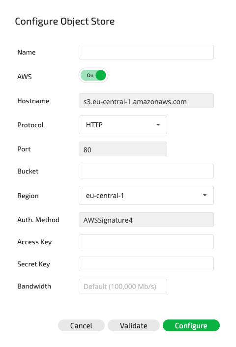
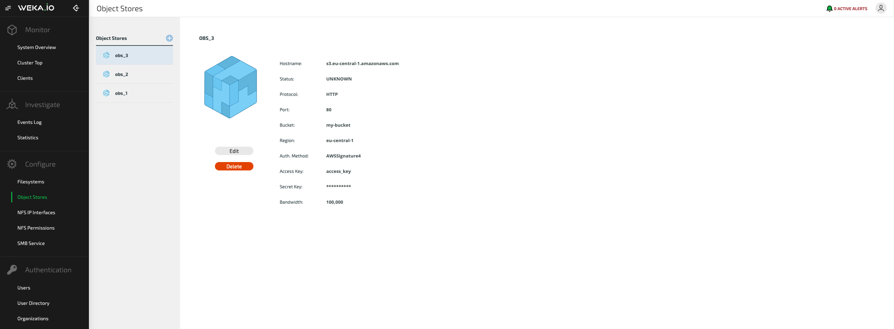

# Managing Object Stores

## Viewing Object Stores

### Viewing Object Stores Using the GUI

The main object store screen in the GUI lists all existing object stores and can also display information about a specific object store, including the object store name, status and region.

### Viewing Object Stores Using the CLI

**Command:** `weka fs tier s3`

This command is used to view information on all the object stores configured to the Weka system.

## Adding an Object Store

### Adding an Object Store Using the GUI

From the main object store view screen, click the "+" button at the top left-hand side of the screen. The Configure Object Store dialog box will be displayed.

Enter the relevant parameters and click Configure to create the object store.

If the object store is misconfigured, the Error in Object Store Configuration window will be displayed.

Click Save Anyway in order to save the configured object store.

### Adding an Object Store Using the CLI

**Command:** `weka fs tier s3 add`

Use the following command line to add an object store:

`weka fs tier s3 add <name> [--hostname=<host>] [--port=<port> [--bucket=<bucket>] [--auth-method=<auth-method>] [--region=<region>] [--access-key-id=<access-key-id>] [--secret-key=<secret-key>] [--protocol=<protocol>] [--bandwidth=<bandwidth>] [--errors-timeout=<errors-timeout>] [--prefetch-mib=<prefetch-mib>] [--max-concurrent-downloads=<max-concurrent-downloads>] [--max-concurrent-uploads=<max-concurrent-uploads>] [--max-concurrent-removals=<max-concurrent-removals>]`

**Parameters in Command Line**

| **Name** | **Type** | **Value** | **Limitations** | **Mandatory** | **Default** |
| :--- | :--- | :--- | :--- | :--- | :--- |
| `name` | String | Name of the object store being created | Must be a valid name | Yes | ​ |
| `hostname` | String | Object store host identifier | Must be a valid name/IP | Yes |  |
| `port` | String | Object store port | Must be a valid name | No | 80 |
| `bucket` | String | Object store bucket name | Must be a valid name | Yes |  |
| `auth-method` | String | Authentication method | None, AWSSignature2 or AWSSignature4 | Yes |  |
| `region` | String | Region name |  | Yes |  |
| `access-key-id` | String | Object store access key ID |  | Yes \(can be left empty when using IAM role in AWS\) |  |
| `secret-key` | String | Object store secret key |  | Yes \(can be left empty when using IAM role in AWS\) |  |
| `bandwidth` | Number | Bandwidth limitation per core \(Mbps\) |  | No |  |
| `errors-timeout` | Number | If the OBS link is down for longer than this timeout period, all IOs that need data return with an error | 1-15 minutes, e.g: 5m or 300s | No | 300 |
| `prefetch-mib` | Number | How many MiB of data to prefetch when reading a whole MiB on object store |  | No | 0 |
| `max-concurrent-downloads` | Number | Maximum number of downloads concurrently performed on this object store in a single IO node | 1-64 | No | 64 |
| `max-concurrent-uploads` | Number | Maximum number of uploads concurrently performed on this object store in a single IO node | 1-64 | No | 64 |
| `max-concurrent-removals` | Number | Maximum number of removals concurrently performed on this object store in a single IO node | 1-64 | No | 64 |


**Note:** When using the CLI, by default a misconfigured object store will not be created. To create an object store even when it is misconfigured, use the `--skip-verification`option.



**Note:** Up to 2 different object stores buckets can be configured per filesystem in the Weka system.


## Editing an Object Store

### Editing an Object Store Using the GUI

From the main object store view screen, click the Edit button of the object store to be edited.

The Update Object Store dialog box \(which is similar to the Configure Object Store dialog box\) will be displayed with the current specifications for the object store.

Make the relevant changes and click Update to update the object store.

### Editing an Object Store Using the CLI

**Command:** `weka fs tier s3 update`

Use the following command line to edit an object store:

`weka fs tier s3 update <name> [--new-name=<new-name>] [--hostname=<host>] [--port=<port> [--bucket=<bucket>] [--auth-method=<auth-method>] [--region=<region>] [--access-key-id=<access-key-id>] [--secret-key=<secret-key>] [--protocol=<protocol>] [--bandwidth=<bandwidth>] [--errors-timeout=<errors-timeout>] [--prefetch-mib=<prefetch-mib>] [--max-concurrent-downloads=<max-concurrent-downloads>] [--max-concurrent-uploads=<max-concurrent-uploads>] [--max-concurrent-removals=<max-concurrent-removals>]`

**Parameters in Command Line**

| **Name** | **Type** | **Value** | **Limitations** | **Mandatory** | **Default** |
| :--- | :--- | :--- | :--- | :--- | :--- |
| `name` | String | Name of the object store being edited | Must be a valid name | Yes | ​ |
| `new-name` | String | New name for the object store | Must be a valid name | No |  |
| `hostname` | String | Object store host identifier | Must be a valid name/IP | Yes |  |
| `port` | String | Object store port | Must be a valid name | Yes |  |
| `bucket` | String | Object store bucket name | Must be a valid name | Yes |  |
| `auth-method` | String | Authentication method | None, AWSSignature2 or AWSSignature4 | Yes |  |
| `region` | String | Region name |  | Yes |  |
| `access-key-id` | String | Object store access key ID |  | Yes \(can be left empty when using IAM role in AWS\) |  |
| `secret-key` | String | Object store secret key |  | Yes \(can be left empty when using IAM role in AWS\) |  |
| `bandwidth` | Number | Bandwidth limitation per core \(Mbps\) |  | No |  |
| `errors-timeout` | Number | If the OBS link is down for longer than this timeout period, all IOs that need data return with an error | 1-15 minutes, e.g: 5m or 300s | No |  |
| `prefetch-mib` | Number | How many MiB of data to prefetch when reading a whole MiB on object store |  | No |  |
| `max-concurrent-downloads` | Number | Maximum number of downloads concurrently performed on this object store in a single IO node | 1-64 | No |  |
| `max-concurrent-uploads` | Number | Maximum number of uploads concurrently performed on this object store in a single IO node | 1-64 | No |  |
| `max-concurrent-removals` | Number | Maximum number of removals concurrently performed on this object store in a single IO node | 1-64 | No |  |

## Deleting an Object Store

### Deleting an Object Store Using the GUI

From the main object store view screen, click the Delete button of the object store to be deleted.

The Deletion of Object Store window will be displayed.

Click Yes to delete the object store.

### Deleting an Object Store Using the CLI

**Command:** `weka fs tier s3 delete`

Use the following command line to delete an object store:

`weka fs tier s3 delete <name>`

**Parameters in Command Line**

| **Name** | **Type** | **Value** | **Limitations** | **Mandatory** | **Default** |
| :--- | :--- | :--- | :--- | :--- | :--- |
| `name` | String | Name of the object store being deleted | Must be a valid name | Yes | ​ |

