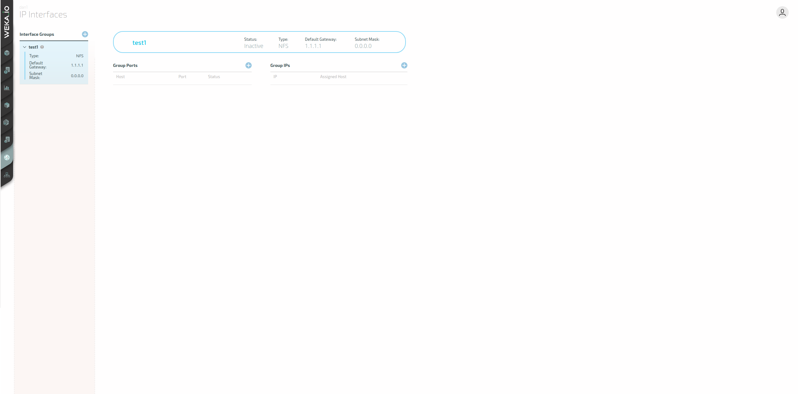
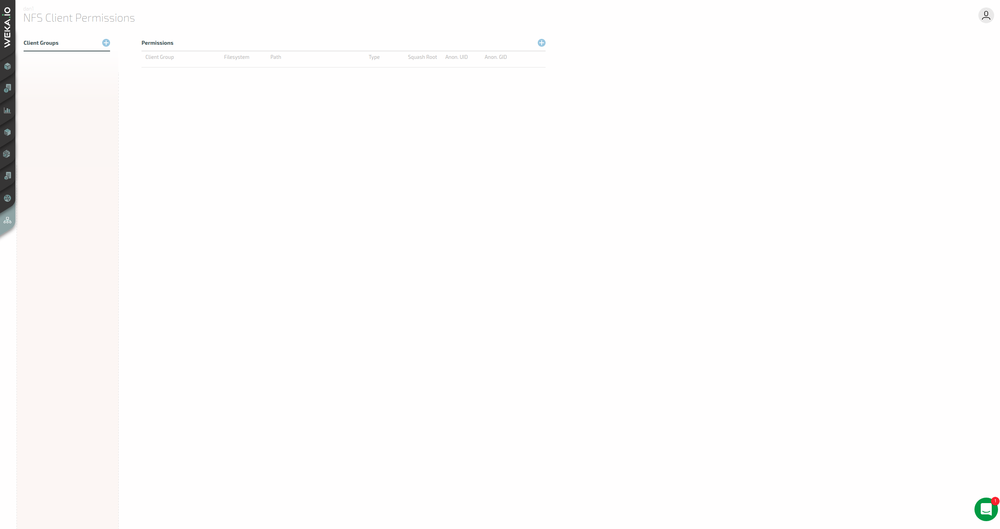
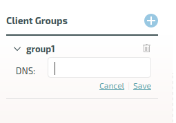
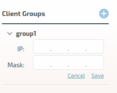

# NFS Support

## Overview

The NFS protocol allows client hosts to access the WekaIO filesystem without installing WekaIO’s client software using the standard NFS implementation of the client host operating system. While this implementation is easier to deploy, it does not compare in performance to the WekaIO client.

In order to implement NFS service from a WekaIO cluster, the following steps must be implemented:

| **Step** | **Method of Implementation** |
| :--- | :--- |
| Define a set of hosts that will provide the NFS service, which can be the whole cluster or a subset of the cluster. | By defining an interface group. |
| Define Ethernet ports on each of the defined hosts that will be used to provide the NFS service. | By defining an interface group. |
| Allocate a pool of IP addresses that will be used by the WekaIO software to provide the NFS service. | By defining an interface group. |
| Define a Round-robin DNS name that will resolve to the floating IPs. | On the local DNS service configuration; does not involve WekaIO management. |
| Define the list of client hosts that will be permitted to access file systems via NFS. | By creating a client permission group. |
| Configure which client hosts can access which file system. | By creating a client permission group. |
| Mount the file systems on the client hosts using the NFS mount operating system support. | On the client operating system; does not involve WekaIO management. |

## Implementing NFS Service from a WekaIO Cluster

### Defining the NFS Networking Configuration \(Interface Groups\)

In order to define the NFS service, one or more interface groups must be defined. An interface group consists of the following:

* A collection of WekaIO hosts with an Ethernet port for each host, where all the ports must belong to the same layer 2 subnet.
* A collection of floating IPs that serve the NFS protocol on the hosts and ports. All IP addresses must belong to the layer 2 subnet above.
* A routing configuration for the IPs which must comply with the IP network configuration.

Up to 10 different Interface groups can be defined, where multiple interface groups can be used if the cluster needs to connect to multiple layer 2 subnets. Up to 50 hosts can be defined in each interface group.

The WekaIO system will automatically distribute the IP addresses evenly on each host and port. On a failure of the host, the WekaIO system will reasonably redistribute the IP addresses associated with the failed host on other hosts. To minimize the effect of any host failures, it is recommended to define sufficient floating IPs so that the WekaIO system can assign 4 floating IPs per host.


**Note:** The WekaIO system will configure the host IP networking for the NFS service on the host operating system. It should not be defined by the user.


### Configuring the Round-Robin DNS Server

To ensure that the various NFS clients will balance the load on the various WekaIO hosts serving NFS, it is recommended to define a [Round-robin DNS](https://en.wikipedia.org/wiki/Round-robin_DNS) entry which will resolve to the list of floating IPs, ensuring that client loads will be equally distributed across all hosts.

### Defining NFS Access Control \(Client Access Groups\)

In order to control which host can access which file system, NFS client permission groups must be defined. Each NFS client permission group contains:

* A list of filters for IP addresses or DNS names of clients that can be connected to the WekaIO system via NFS.
* A collection of rules that control access to specific filesystems.

### Configuring NFS on the Client

The NFS mount should be configured on the client host via the standard NFS stack operating system. The NFS server IP address should point to the Round-robin DNS name defined above.

## Load Balancing and Resiliency of the NFS Service

The WekaIO NFS service is a scalable, fully load-balanced and resilient service which provides continuous service through failures of any kind.

Scalability is implemented by defining many hosts that serve the NFS protocol, thereby enabling the scaling of performance by adding more hosts to the interface group.

Load balancing is implemented via floating IPs. By default, the floating IPs are evenly distributed over all the interface group hosts/ports. When different clients resolve the DNS name into an IP service, each of them receives a different IP address, thereby ensuring that different clients will access different hosts. This allows the WekaIO system to scale and service thousands of clients.

The same mechanism ensures the resiliency of the service. On a host failure, all IP addresses associated with the failed host will be reassigned to other hosts \(using the GARP network messages\) and the clients will reconnect to the new hosts without any reconfiguration or service interruption.

## Managing NFS Networking Configuration \(Interface Groups\)

### Defining Interface Groups

#### Defining Interface Groups Using the GUI 

Access the IP Interfaces screen. 

To define an interface group, click the '+' button at the top left-hand side of the screen. The add Interface Groups dialog box will be displayed.

Enter the Group Name \(this has to be unique\), the Default Gateway and the Subnet Mask. Then click Save.

#### Defining Interface Groups Using the CLI 

**Command:** `weka nfs interface-group add`

Use the following command line to add an interface group:

`weka nfs interface-group add <name> <type> [--subnet=<subnet>] [--gateway=<gw>]` 

**Parameters in Command Line**

| **Name** | **Type** | **Value** | **Limitations** | **Mandatory** | **Default** |
| :--- | :--- | :--- | :--- | :--- | :--- |
| `name` | String | Unique interface group name   | None | Yes |  |
| `type` | String | Group type | Can only be  NFS | Yes | NFS |
| `subnet` | String | Subnet mask in the 255.255.0.0 format | Valid netmask | No | 255.255.255.255 |
| `gw` | String | Gateway IP | Valid IP | No | 255.255.255.255 |

### Setting Interface Group Ports

**Setting Interface Group Ports using the GUI**

Access the Group Ports table.

To set interface group ports, click the '+' button on the top right-hand side of the Group Ports table. Then select the relevant hosts and ports and click Save.

To remove an interface group port, click the trash symbol displayed next to the host's status.  

**Setting Interface Group Ports using the CLI**

**Commands:** `weka nfs interface-group port add`and `weka nfs interface-group port delete`

Use the following command lines to add/delete an interface group port:`weka nfs interface-group port add <name> <host-id> <port>   
weka nfs interface-group port delete <name> <host-id> <port>` 

**Parameters in Command Line**

| **Name** | **Type** | **Value** | **Limitations** | **Mandatory** | **Default** |
| :--- | :--- | :--- | :--- | :--- | :--- |
| `name` | String | Interface group name | None | Yes |  |
| `host-id` | String | Host ID on which the port resides\* | Valid host ID | Yes |  |
| `port` | String | Port's device, e.g., eth1 | Valid device | Yes |  |


\*It is possible to obtain host IDs using the following command:  
`weka cluster host -H=<hostname>`


### **Setting Interface Group IPs**

**Setting Interface Group IPs using the GUI**

Access the Group IPs table.

To set IPs for the selected group, click the '+' button on the top right-hand side of Group IPs  table. Then enter the relevant IP range and click Save.

To remove an IP, click the the trash symbol displayed next to the IP in the table.

**Setting Interface Group IPs using the CLI**

**Commands:** `weka nfs interface-group ip-range add`and `weka nfs interface-group ip-range delete`

Use the following command lines to add/delete an interface group IP:  
`weka nfs interface-group ip-range add <name> <ips>     
weka nfs interface-group ip-range delete <name> <ips>` 

**Parameters in Command Line**

| **Name** | **Type** | **Value** | **Limitations** | **Mandatory** | **Default** |
| :--- | :--- | :--- | :--- | :--- | :--- |
| `name` | String | Interface group name | None | Yes |  |
| `ips` | String | IP range | Valid IP range | Yes |  |

## **Managing NFS Access Control \(Client Access Groups\)**

### Defining Client Access Groups

#### Defining Client Access Groups Using the GUI 

Access the NFS Client Permissions screen.

To define a client access group, click the '+' button on the top left-hand side of the screen. Enter the client access group name and click Save.

#### Defining Client Access Groups Using the CLI 

**Command:** `weka nfs client-group`

Use the following command lines to add/delete a client access group:  
`weka nfs client-group add <name>  
weka nfs client-group delete <name>`

**Parameters in Command Line**

| **Name** | **Type** | **Value** | **Limitations** | **Mandatory** | **Default** |
| :--- | :--- | :--- | :--- | :--- | :--- |
|  `name` | String | Group name | Valid name | Yes |  |

### Managing Client Access Groups

#### **Managing Client Access Groups Using the GUI**

To add IPs or DNS rules to a group, access the relevant Client Groups dialog box.

Click +Add IP or +Add DNS. The appropriate dialog box will be displayed.

Enter the required values - DNS or IP and Mask, respectively, and click Save.

To remove an IP or DNS from a client group, click the trash symbol displayed next to IP or DNS.

#### **Managing Client Access Groups Using the CLI**

**Adding/Deleting DNS**

**Command:** `weka nfs rules` 

Use the following command lines to add/delete a client group DNS:  
`weka nfs rules add dns <name> <dns>  
weka nfs rules delete dns <name> <dns>`

**Parameters in Command Line**

| **Name** | **Type** | **Value** | **Limitations** | **Mandatory** | **Default** |
| :--- | :--- | :--- | :--- | :--- | :--- |
|  `name` | String | Group name | Valid name | Yes |  |
|   `dns` | String | DNS rule with \*?\[\] wildcard rules |  | Yes |  |

**Adding/Deleting an IP**

**Command:** `weka nfs rules` 

Use the following command lines to add/delete a client group IP:  
`weka nfs rules add ip <name> <ip>  
weka nfs rules delete ip <name> <ip>`

**Parameters in Command Line**

| **Name** | **Type** | **Value** | **Limitations** | **Mandatory** | **Default** |
| :--- | :--- | :--- | :--- | :--- | :--- |
| `name` | String | Group name | Valid name | Yes |  |
|   `ip` | String | IP with net mask rule, in the 1.1.1.1/255.255.0.0 format | Valid IP | Yes |  |

### **Managing NFS Client Permissions**

#### **Managing NFS Client Permissions Using the GUI**

To add client permissions, click the top right-hand '+' icon in the Client Permissions table. The Permissions dialog box will be displayed.

Define the the following parameters: 

* Client Group: the client group to receive permissions.
* Filesystem: the filesystem to receive permissions.
* Path: The path that will be the root of the share.
* Type: The type of access to be provided - RO \(read only\) or RW \(Read/Write\).
* Squash Root: Set to ON or OFF.
* Anom. UID: Anonymous user ID \(relevant only for root squashing\).
* Anom. GID: Anonymous user group ID \(relevant only for root squashing\)

Then click Save. 

**Managing NFS Client Permissions Using the CLI**

**Command:** `weka nfs permission` 

Use the following command lines to add/update/delete NFS permissions:  
`weka nfs permission add <filesysten> <group> [--path=<path>][--permission-type=<perm>]  
weka nfs permission update <filesysten> <group> [--path=<path>][--permission-type=<perm>]  
weka nfs permission delete <filesysten> <group> [--path=<path>]`

**Parameters in Command Line**

| **Name** | **Type** | **Value** | **Limitations** | **Mandatory** | **Default** |
| :--- | :--- | :--- | :--- | :--- | :--- |
| `filesysten` | String | Filesystem name | Existing filesystem | Yes |  |
|  `group` | String | Client group name | Existing client group | Yes |  |
|  `path` | String | Root of the share | Valid path | No | / |
| `perm` | String | Permission type  | RO: read only           RW: read write | No |  |

Use the following command lines to add/update root-squashing:  
`weka nfs permission add root-squashing <filesysten> <group> <permission-type> <anon-uid> <anon-gid> [--path=<path>]  
weka nfs permission update root-squashing <filesysten> <group> <permission-type> <anon-uid> <anon-gid> [--path=<path>]`

**Parameters in Command Line**

| **Name** | **Type** | **Value** | **Limitations** | **Mandatory** | **Default** |
| :--- | :--- | :--- | :--- | :--- | :--- |
|  `filesysten` | String | Filesystem name | Existing filesystem | Yes |  |
|  `group` | String | Client group name | Existing client group | Yes |  |
| `permission-type` | String | Permission type | RO: read only                             RW: read write | Yes |  |
| `anon-uid` | Int | Anonymous user ID \(relevant only for root squashing\) | Valid UID \(between 0 and 65535\) | Yes |  |
| `anon-gid` | Int | Anonymous user group ID \(relevant only for root squashing\) | Valid GID \(between 0 and 65535\) | Yes |  |
|  `path` | String | Root of the share | Valid path | No | / |

## Client Mounts

### Supported Mount Options for NFS Clients

#### Non-Coherent Mount Options

* `ac`
* `async`
* `noatime`
* `lookupcache=all`

#### Coherent Mount Options

* `noac`
* `sync`
* `atime`
* `lookupcache=none`

#### Common Mount Options

* `rw`
* `hard`
* `nolock`
* `vers=3`
* `mountvers=3`
* `proto=tcp`
* `mountproto=tcp`
* `rsize=524288`
* `wsize=524288`
* `namlen=255`
* `timeo=600`
* `retrans=2`
* `sec=sys`


**Note:** These are the NFS mount defaults.


