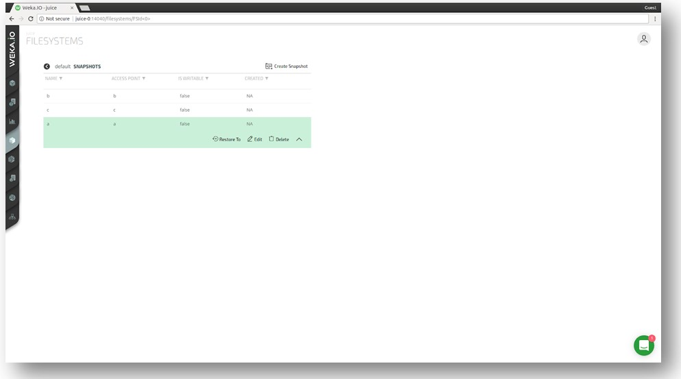
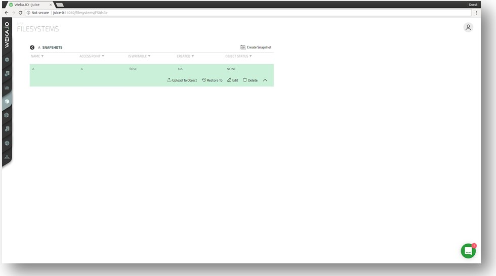
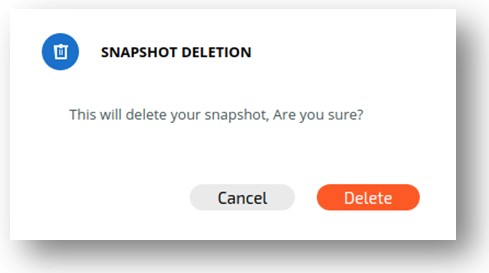
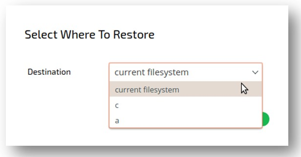
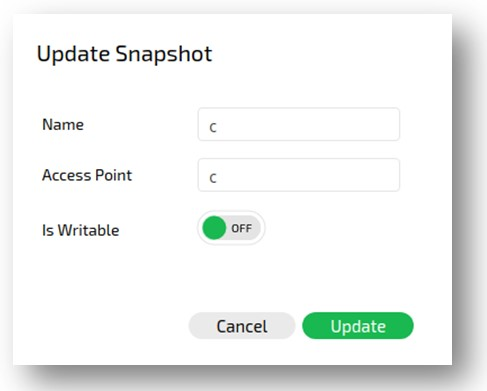

# Snapshots

## About Snapshots

Snapshots allow the saving of a filesystem state to a directory \(`.snapshots)`located under the root filesystem. They can be used for:

* **Physical Backup:** The snapshot directory can be copied into a different storage system, possibly on another site, using either Weka's Snap to Object feature or a third-party software.
* **Logical Backup:** Periodic snapshots enable filesystem restoration to a previous state 

  if logical data corruption occurs.

* **Archive:** Periodic snapshots enable the accessing of a previous filesystem state for compliance or other needs.
* **DevOps Environments:** Writable snapshots enable the execution of software tests on copies of the data.

Snapshots have practically no impact on system performance and can be taken for each filesystem while applications are running. They consume minimal space, according to the actual differences between the filesystem and the snapshots, or between the snapshots, in 4K granularity. By default, snapshots are read-only, and any attempts to change the contents of a read-only snapshot returns an error message. However, it is possible to create a writable snapshot or update an existing snapshot to be writable. 

WekaIO supports the following snapshots operations:

* Viewing snapshots
* Creating a snapshot of an existing filesystem
* Deleting a snapshot
* Accessing a snapshot under a dedicated directory name
* Restoring a filesystem from a snapshot
* Making snapshots writable
* Creating a snapshot of a snapshot \(relevant for writable snapshots, or for read-only snapshot before being made writable\),
* Listing of snapshots and obtaining their metadata


**Note:** When moving a file in or out of a snapshot directory, or between snapshots, the kernel will implement the move operation as a copy operation, just as when moving a file between two different filesystems. Such operations for directories will fail.

**Note:** The number of snapshots per system is limited to 4,096.


## Managing Snapshots

### Viewing Snapshots

#### Viewing Snapshots Using the GUI

To view the snapshot of filesystem, click the filesystem Show Snapshots button.

If the filesystem is tiered, this screen is slightly different, and includes an additional button, Upload to Object, and a corresponding Object Status value, as shown below: 

#### Viewing Snapshots Using the CLI

**Command:** `weka fs snapshot`

This command is used to display all snapshots of all filesystems in a single table. 

### Creating a Snapshot

#### Creating a Snapshot Using the GUI

From the main snapshot view screen, click Create Snapshot at the top right-hand side of the required filesystem snapshot screen. The Create Snapshot dialog box will be displayed.

Enter the name and access point, determine whether it is writable and the source \(the current filesystem or another snapshot\). Then click Create to create the snapshot.

#### Creating a Snapshot Using the CLI

**Command:** `weka fs snapshot create`

Use the following command line to add a snapshot:

`weka fs snapshot create <file-system> <name> [<access-point>] [--source-snap=<source>] [--is-writable]`

**Parameters in Command Line**

| **Name** | **Type** | **Value** | **Limitations** | **Mandatory** | **Default** |
| :--- | :--- | :--- | :--- | :--- | :--- |
| `file-system` | String | A valid filesystem identifier | Must be a valid name | Yes | ​ |
| `name` | String | Unique name for filesystem snapshot | Must be a valid name | Yes |  |
| `access-point` | String | Name of newly-created directory for filesystem level snapshots, which will serve as the access point for the snapshots | Must be a valid name | Yes |  |
| `source` | String | Must be an existing snapshot | Must be a valid name | No | Filesystem snapshot the file system |
| `is_writable` | Boolean | Sets the created snapshot to be writable |  | No | False |

### Deleting a Snapshot

#### Deleting a Snapshot Using the GUI

In the main snapshot view screen, select the filesystem to be deleted and click Delete. The Snapshot Deletion window will be displayed.

Click Delete to delete the selected snapshot.

#### Deleting a Snapshot Using the CLI

**Command:** `weka fs snapshot delete`

Use the following command line to delete a snapshot:

`weka fs snapshot delete <file-system> <name>`

**Parameters in Command Line**

| **Name** | **Type** | **Value** | **Limitations** | **Mandatory** | **Default** |
| :--- | :--- | :--- | :--- | :--- | :--- |
| `file-system` | String | A valid filesystem identifier | Must be a valid name | Yes | ​ |
| `name` | String | Unique name for filesystem snapshot | Must be a valid name | Yes |  |

### Restoring a Filesystem from a Snapshot

#### Restoring a Filesystem or a Snapshot from another Snapshot Using the GUI

In the main snapshot view screen, select the filesystem snapshot to be restored and click Restore To. The Snapshot Restore Destination window will be displayed.

Select the filesystem snapshot restore destination. 

#### Restoring a Filesystem or a Snapshot from another Snapshot Using the CLI 

**Commands:** `weka fs restore` or `weka fs snapshot copy`

Use the following command line to restore a filesystem from a snapshot:

`weka fs restore <file-system> <source-name>`

Use the following command line to restore a snapshot to another snapshot:

`weka fs snapshot copy <file-system> <source-name> <destination-name>`

**Parameters in Command Lines**

| **Name** | **Type** | **Value** | **Limitations** | **Mandatory** | **Default** |
| :--- | :--- | :--- | :--- | :--- | :--- |
| `file-system` | String | A valid filesystem identifier | Must be a valid name | Yes | ​ |
| `source-name` | String | Unique name for the source of the snapshot | Must be a valid name | Yes |  |
| `destination-name` | String | Name of the destination to which the snapshot should be copied | Must be a valid name | Yes |  |

### Updating a Snapshot

#### Updating a Snapshot Using the GUI

In the main snapshot view screen, select the filesystem snapshot to be updated and click Edit. The Update Snapshot window will be displayed.

Enter the name and access point, determine whether it is writable and then click Update to update the snapshot.

#### Updating a Snapshot Using the CLI

**Command:** `weka fs snapshot update`

This commands changes the snapshot attributes. Use the following command line to update an existing snapshot:

`weka fs snapshot update <file-system> <name> [--new-name=<new-name>] [--is-writable] [--access-point=<access-point>]`

**Parameters in Command Line**

| **Name** | **Type** | **Value** | **Limitations** | **Mandatory** | **Default** |
| :--- | :--- | :--- | :--- | :--- | :--- |
| `file-system` | String | A valid filesystem identifier | Must be a valid name | Yes | ​ |
| `name` | String | Unique name for the updated snapshot | Must be a valid name | Yes |  |
| `new-name` | String | New name for the updated snapshot | Must be a valid name | No |  |
| `is-writable` | Boolean | Sets the snapshot to be writable |  | No |  |
| `access-point` | String | Name of directory for snapshot, which will serve as the access point for the snapshot | Must be a valid name | No |  |

