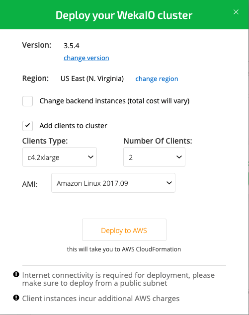
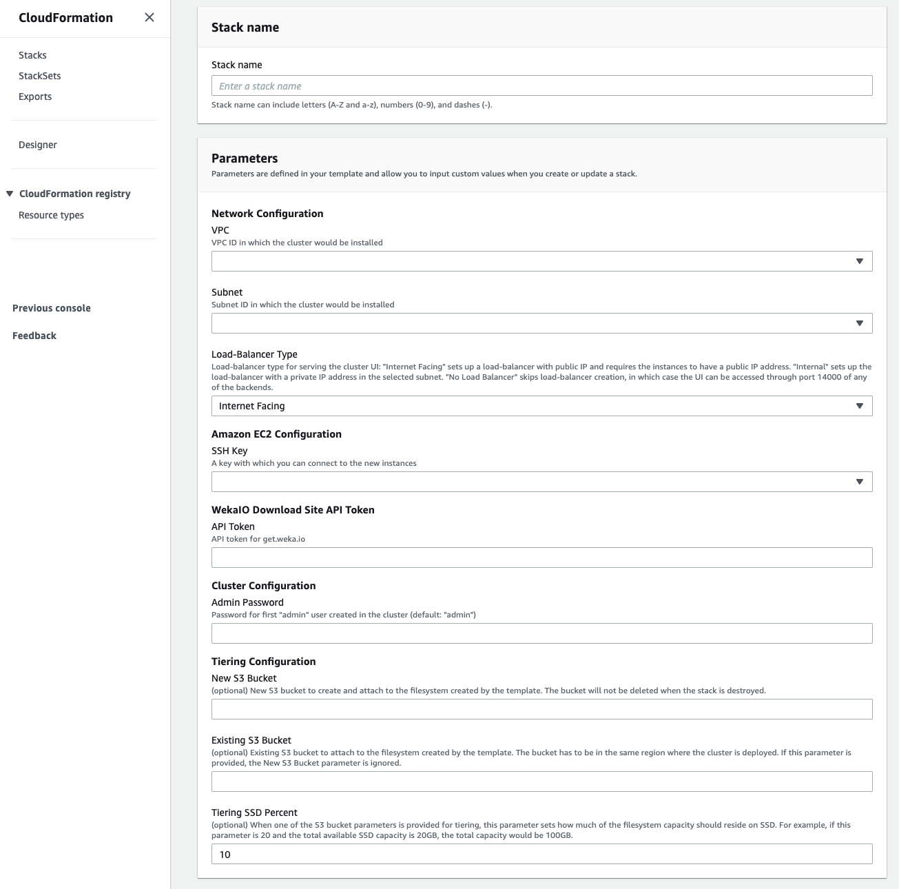

# Self-Service Portal

## Overview

The WEKA Self-Service Portal is a planning tool for WEKA clusters to meet storage requirements when installing in AWS.

It is possible to start by just entering the capacity required, configuring advanced parameters such as required performance and even provision of a multi-AZ cluster for added reliability.

Each configuration can be immediately deployed as a CloudFormation stack by redirecting to the AWS console.


**Note:** CloudFormation should only be used for initial deployment. To expand cluster resources, refer to [Expanding & Shrinking Cluster Resources](../../usage/expanding-and-shrinking-cluster-resources/).


Once the cluster is deployed:

1. Refer to [Managing the WEKA System ](../../getting-started-with-weka/managing-wekaio-system.md)for getting started with WEKA CLI and GUI.
2. Refer to [Performing the First IO](../../getting-started-with-weka/performing-the-first-io.md) to quickly get familiar with creating, mounting and writing to a WekaFS filesystem.

## Planning a Cluster

The Self-Service Portal is available at [https://start.weka.io](https://start.weka.io/). Its main screen is divided into two panes: the left pane, which is used for inputting requirements, and the right pane which displays possible configurations for the defined requirements.

As shown in the screen above, configuration options include the total capacity, the desired deployment model and additional performance requirements. For more information about deployment types, refer to [Deployment Types](deployment-types.md).

## Deploying a Cluster

Once the configuration to be deployed has been found, click the Deploy to AWS button next to the desired configuration. At this point, it is possible to specify additional options for the deployment, such as adding client instances or selecting the WEKA system version to be deployed.

Once everything is ready to deploy the cluster, click the Deploy to AWS button. This will display the AWS CloudFormation screen with a template containing the configured cluster. _\*\*_


**Note: Before deploying the configuration,** check that your AWS account limits allow for the deployment of your selected configuration \(it is possible to check your limits under the Limits tab in the EC2 console\).


## CloudFormation Screen

After clicking the Deploy to AWS button, the AWS CloudFormation screen is displayed, requiring the creation of stacks.

In the Create Stack screen, define the parameters which are specific to your AWS account:

| Parameter | Description |
| :--- | :--- |
| `Stack name` | The name that will be given to the stack in CloudFormation. This name has to be unique in the account. |
| `SSH Key` | The SSH-key for the `ec2-user` that will be used to connect to the instances. |
| `VPC` | The VPC in which the WEKA cluster will be deployed. |
| `Subnet` | The subnet in which the WEKA cluster will be deployed. |

Define the parameters for WEKA cluster configuration:

| Parameter | Description |
| :--- | :--- |

<table>
  <thead>
    <tr>
      <th style="text-align:left"><code>Load-Balancer Type</code>
      </th>
      <th style="text-align:left">
        
Load balancer type for serving the cluster UI:

        <ul>
          <li><code>Internet Facing</code> sets up the load balancer with a public IP.</li>
          <li><code>Internal</code> sets up the load balancer with a private IP address
            in the selected subnet.</li>
          <li><code>No Load Balancer</code> skips load balancer creation, in which case
            the UI can be accessed through port 14000 of any of the backend instances.</li>
        </ul>
      </th>
    </tr>
  </thead>
  <tbody></tbody>
</table>| `API Token` | The API token for WEKA's distribution site. This can be obtained at [https://get.weka.io/ui/account/api-tokens](https://get.weka.io/ui/account/api-tokens). |
| :--- | :--- |

| `Admin Password` | Sets the admin password after the cluster has been created. If no value is provided, the password is set to `admin.` |
| :--- | :--- |

| Parameter | Description |
| :--- | :--- |
| `New S3 Bucket` | The new S3 bucket name to create and attach to the filesystem created by the template. The bucket will not be deleted when the stack is destroyed. |
| `Existing S3 Bucket` | The existing S3 bucket name to attach to the filesystem created by the template. The bucket has to be in the same region where the cluster is deployed. If this parameter is provided, the `New S3 Bucket` parameter is ignored. |
| `Tiering SSD Percent` | Sets how much of the filesystem capacity \(in percent\) should reside on SSD. This parameter is applicable only if `New S3 Bucket` or `Existing S3 Bucket` parameters have been defined. |


**Important Note Concerning Internet Connectivity:** WEKA deployment requires _\*\*_internet connectivity. Ensure that there is either a NAT or public subnet, and configure the stack parameters accordingly.

If using a NAT, make sure not to set the load balancer type as`Internet Facing`.

For public subnets, make sure to select a subnet that has the Enable Auto-Assign Public IPv4 Address setting turned on, or select a subnet that has Internet connectivity.


Once all required parameters have been filled-in, make sure to check the "I acknowledge that AWS CloudFormation might create IAM resources” checkbox at the bottom and click the Create Stack button:

## Cluster Deployment Process

The cluster deployment process takes about 10 minutes. During this time, the following occurs:

1. The AWS resources required for the cluster are provisioned.
2. The WEKA system is installed on each of the instances provisioned for the cluster.
3. A cluster is created using all backend instances.
4. All client instances are created.
5. A filesystem is created using all the available capacity and is mounted on all client instances.This shared filesystem is mounted on `/mnt/weka` in each of the cluster instances.

Once the deployment is complete, the stack status will be updated to `CREATE_COMPLETE`. At this point, it is possible to access the WEKA system cluster GUI by going to the Outputs tab of the CloudFormation stack and clicking the GUI link \(or by [http://&lt;backend-host&gt;:14000](http://<backend-host>:14000), if `No Load Balancer` has been selected\).

Visit [Managing the WEKA System ](../../getting-started-with-weka/managing-wekaio-system.md)for getting started with WEKA CLI and GUI, and [Performing the First IO](../../getting-started-with-weka/performing-the-first-io.md) to quickly get familiar with creating, mounting and writing to a WekaFS filesystem.


**Note:** If the deployment is unsuccessful, see [Troubleshooting](troubleshooting.md) for how to resolve common deployment issues.


