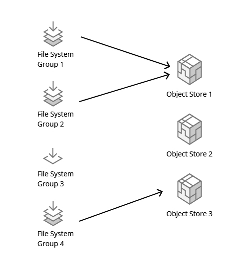

# Filesystems, Object Stores & Filesystem Groups

## About Filesystems

A WekaIO filesystem is similar to a regular on-disk filesystem, with the key difference that it's distributed across all the hosts in the cluster. Consequently, in the Weka system, filesystems are not associated with any physical object, and are therefore nothing but a root directory with space limitations. 

A total of up to 1024 filesystems are supported, all of which are equally and perfectly balanced on all SSDs and CPU cores assigned to the Weka system. This means that the allocation of a new filesystem, or the resizing a filesystem, are instant management operations that are performed instantly, and without any constraints.


**Note:** A filesystem group \(see below\) has to be created before creating a filesystem, and every filesystem must belong to one filesystem group.


A filesystem must have a defined capacity limit. A filesystem that belongs to a tiered filesystem group \(see below\) must have a total capacity limit and an SSD capacity limit. The total SSD capacity of all filesystems cannot exceed the total SSD capacity as defined in the total SSD net capacity.

## About Object Stores

In the Weka system, object stores represent an optional external storage media, ideal for the storage of warm data. They can be purchased and configured independently by users \(provided they support the S3 protocol\) or supplied by WekaIO as part of the overall data storage solution. Object stores used in tiered Weka system configurations can be cloud-based, located in the same location or at a remote location.

Object stores are optimally used when a cost-effective data storage tier is required, at a price point which cannot be satisfied by server-based SSDs. An object store definition contains the object store DNS name, bucket identifier and access credentials. The bucket must be dedicated to the Weka system and must not be accessible by other applications. However, a single object store bucket may serve different filesystem groups, and even different filesystem groups that reside on different Weka systems.

## About Filesystem Groups

In the Weka system, filesystems are grouped into up to 8 filesystem groups. Each filesystem group consists of a collection of filesystems which share a common connectivity to an object store system. This connectivity to object stores can be used in both the data lifecycle management and Snap to Object features.

A filesystem group may have a single object store associated with it, and multiple filesystem groups can be associated with the same object store. A filesystem group that has an associated object store can also define data lifecycle management parameters.

Each filesystem group may contain a data lifecycle management configuration and an object store definition, or alternatively be defined only to SSDs.

Once a filesystem group is connected to an object store, it cannot be disconnected from the object store or changed to a different bucket or object store. However, if reconfiguration of the object store identification information is required, such as changing connectivity definitions, DNS name, bucket name, access control parameters or the password, it can be edited, after which all the filesystem groups will work according to the new definitions. It is assumed that after such a change the same objects will still be available without any change.


**Note:** Each filesystem group has optional tiering control parameters \(see [Guidelines for Data Storage in Tiered Weka System Configurations](data-storage.md#guidelines-for-data-storage-in-tiered-weka-system-configurations)\).



**Note:** For information on managing these entities, refer to [Managing Filesystems, Object Stores and Filesystem Groups](../fs/managing-filesystems.md).


