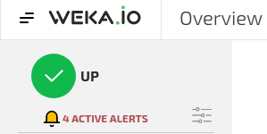
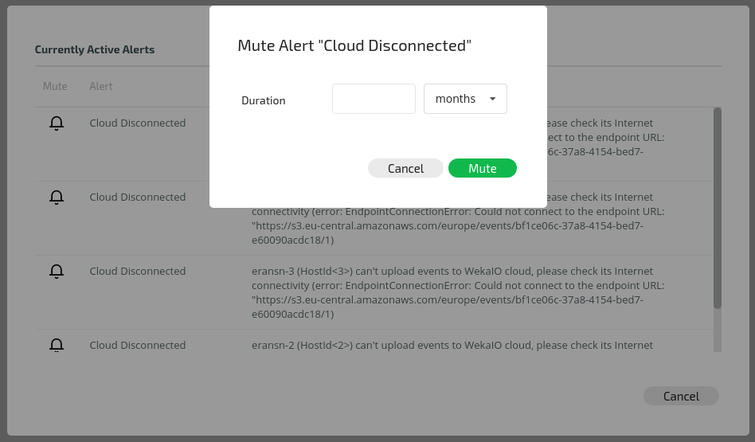

# Alerts

## Overview

WekaIO alerts indicate problematic ongoing states that the cluster is currently suffering from. They can only be dismissed by resolving the root cause of their existence. Usually, an alert is introduced alongside an equivalent event. This can help in identifying the point in time that the problematic state occurred and its root cause.

Alerts are indicated by a yellow triangle. Click the triangle to display a list of active alerts in the system.


**Note:** If for any reason it is not possible to solve the root cause of an alert at any given time, the alert can be muted in order to hide it. This action is only possible from the CLI.


## Working with Alerts Using the GUI

### Viewing Alerts

The following Alerts Overview popup window is displayed in the System Overview, in the top left side of the screen. It presents the status of alerts:


**Note:** If there are no alerts at all \(active/muted\), the bell and text will not be displayed.


To view details of currently active alerts, click the "X ACTIVE ALERTS" text. The following Currently Active Alerts window is displayed:

When hovering on the bell with the mouse, the bell will change color and display the opposite condition of the alert i.e., change active to mute, and vice versa. 

### Muting Alerts

To mute an alert, click the bell of an active alert in the Current Active Alerts window. A dialog box will be displayed, requesting the time period during which the alert is to be muted:

Enter the time period required and click Mute.


**Note:** Alerts cannot be suppressed indefinitely. After expiry of the muted period, the alert is automatically unmuted.



**Note:** When there are only muted alerts, the Alerts Overview popup window will appear as follows:


## Working with Alerts Using the CLI

**Command:** `weka alerts --muted`

Use this command line to list all alerts \(muted and unmuted\) in the WekaIO cluster.

**Optional Sub-commands in Command Line**

`[--types]`: Lists all possible types of alerts that can be returned from the WekaIO cluster.

`[--mute]`: Mutes an alert-type. Muted alerts will not be prompted when listing active alerts. Alerts cannot be suppressed indefinitely, so a duration for the muted period must be provided. After expiry of the muted period, the alert-type is automatically unmuted.

`[--unmute]`: Unmutes a previously muted alert type.

## List of Alerts

| Name | Description |
| :--- | :--- |
| NodeDisconnected | 
 A node is disconnected from the cluster. Check network connectivity to make sure the node can communicate with the cluster. |
| AdminDefault Password | The admin password is still set to the factory default. Change it to ensure only authorized users can access the cluster. |
| CloudHealth | A host cannot upload events to the WekaIO cloud. Check Internet connectivity. |
| NoClusterLicense | No license is assigned. |
| LicenseError | A license conflict exists. |
| ClusterIsUpgrading | Cluster is upgrading. |
| HugePagesAlloc | WekaIO could not allocate RAM on a host via huge pages, because of the host allocation status. |
| Negative UnprovisionedCapacity | The cluster unprovisioned capacity is negative from trying to improve the calculation of spare space required for data protection. |
| HighDrivesCapacity | The average hot tier capacity level is high in relation to the total capacity available. Free-up space or add more hot tier drives to the cluster. |
| DriveDown | A drive is not responding. |
| DriveNeedsPhaseout | A drive has too many errors and is marked as requiring phaseout. |
| JumboConnectivity | A host cannot send jumbo frames to any of its cluster peers. Check the host network settings and the switch to which it is connected. |
| DataProtection | Partial data protection. |
| NodeTiering Connectivity | A node cannot connect to an object store. Check the connection. |
| OfedVersions | A host Mellanox OFED version ID does not match the one used by the WekaIO container. |
| DedicatedWatchdog | A host is configured as a dedicated WekaIO host and requires the installation of a hardware watchdog driver. |
| AgentNotRunning | The WekaIO local control agent is not running on a host. |
| NumaBalancingEnabled | A host has automatic NUMA balancing enabled which can negatively impact performance.  |
| BucketHasNoQuorum | A number of compute nodes are down, causing the bucket compute resource to be unavailable. |
| BucketUnresponsive | A compute resource bucket has failed, causing system unavailability. Check the connectivity and status of the drives. |
| HangingIOs | Some IOs are hanging. |
| ClockSkew | The clock of a host is skewed in relation to the cluster leader, with a time difference more than the permitted maximum of 30 seconds. |
| FilesystemHasToo ManyFiles | The filesystem storage configuration is not large enough for the size of files and directory entries being stored.  |
| NotEnoughConfigured MemoryForFilesystems | The total configured memory bytes for filesystems is insufficient to store the file and directory entries of the filesystems in the cluster.  |
| NotEnoughAvailable MemoryForFilesystems | There are not enough working compute nodes in the cluster to store the file and directory entries for all the filesystems in the cluster.  |

