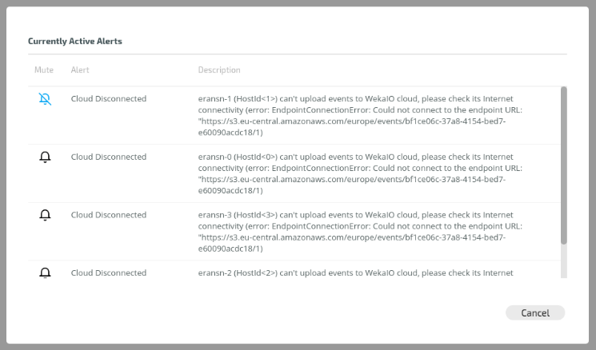

# Alerts

## Overview

WEKA alerts indicate problematic ongoing states that the cluster is currently suffering from. They can only be dismissed by resolving the root cause of their existence. Usually, an alert is introduced alongside an equivalent event. This can help in identifying the point in time that the problematic state occurred and its root cause.

Alerts are indicated by a yellow triangle. Click the triangle to display a list of active alerts in the system.


**Note:** If for any reason it is not possible to solve the root cause of an alert at any given time, the alert can be muted in order to hide it. This action is only possible from the CLI.


## Working with Alerts Using the GUI

### Viewing Alerts

The following Alerts Overview popup window is displayed in the System Overview, in the top left side of the screen. It presents the status of alerts:


**Note:** If there are no alerts at all \(active/muted\), the bell and text will not be displayed.


To view details of currently active alerts, click the "X ACTIVE ALERTS" text. The following Currently Active Alerts window is displayed:

When hovering on the bell with the mouse, the bell will change color and display the opposite condition of the alert i.e., change active to mute, and vice versa.

### Muting Alerts

To mute an alert, click the bell of an active alert in the Current Active Alerts window. A dialog box will be displayed, requesting the time period during which the alert is to be muted:

Enter the time period required and click Mute.


**Note:** Alerts cannot be suppressed indefinitely. After expiry of the muted period, the alert is automatically unmuted.



**Note:** When there are only muted alerts, the Alerts Overview popup window will appear as follows:


## Working with Alerts Using the CLI

### **Listing Alerts Types**

**Command:** `weka alerts types`

Use this command to lists all possible types of alerts that can be returned from the WEKA cluster.

**Command:**`weka alerts describe`

Use this command to describe all the alert types that might be returned from the weka cluster along with possible action items for each alert.

### **Viewing Alerts**

**Command:** `weka alerts`

Use the following command line to list all alerts \(muted and unmuted\) in the WEKA cluster:

`weka alerts [--muted]`

**Parameters in Command Line**

| Name | Type | Value | Limitations | Mandatory | Default |
| :--- | :--- | :--- | :--- | :--- | :--- |
| `--muted` | Boolean | List muted alerts alongside the unmuted ones |  | No | False |

### **Muting Alerts**

**Command:** `weka alerts mute`

Use the following command line to mute an alert-type:

`weka alerts mute <alert-type> <duration>`

Muted alerts will not be prompted when listing active alerts. Alerts cannot be suppressed indefinitely, so a duration for the muted period must be provided. After expiry of the muted period, the alert-type is automatically unmuted.

**Parameters in Command Line**

| Name | Type | Value | Limitations | Mandatory | Default |
| :--- | :--- | :--- | :--- | :--- | :--- |
| `alert-type` | String | An alert-type to mute, use `weka alerts types` to list types |  | Yes |  |
| `duration` | String | How long to mute this alert type for | Format: 3s, 2h, 4m, 1d, 1d5h, 1w | Yes |  |

**Command:** `weka alerts unmute`

Use the following command line to unmute a previously-muted alert-type:

`weka alerts unmute <alert-type>`

**Parameters in Command Line**

| Name | Type | Value | Limitations | Mandatory | Default |
| :--- | :--- | :--- | :--- | :--- | :--- |
| `alert-type` | String | An alert-type to unmute, use `weka alerts types` to list types |  | Yes |  |



